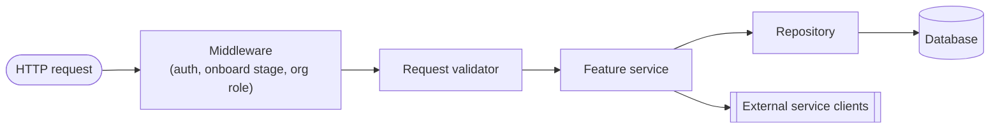

# Mesazon App

Mesazon is a business-management platform; features derive from real business needs.

## Architecture


Internal request flow:



Local build/run/test setup: [Repository setup](docs/repository-setup.md).
Recurring and resolved failure modes: [Known issues](agent-docs/known-issues.md).

## Documentation router

Read only the documents needed for the current change. For any feature change, first read its file in `agent-docs/features/`.

### New feature or endpoint

Start with [Feature flow](agent-docs/features/flow/README.md), then read only the current PR slice:

| Guide | Read when |
|---|---|
| [1. Endpoints](agent-docs/features/flow/01-endpoints.md) | Adding/changing Smithy or Tapir endpoints and their transport models, auth traits, errors, or API docs |
| [2. Validation](agent-docs/features/flow/02-validation.md) | Adding/changing validated domain models, newtypes, arbitraries, validators, or unit tests |
| [3. Schema](agent-docs/features/flow/03-schema.md) | Adding/changing migrations, tables, constraints, indexes, or table config only |
| [4. Repository](agent-docs/features/flow/04-repository.md) | Adding/changing persisted types, Rows, Queries, Repositories, codecs, or DB tests |
| [5. Service](agent-docs/features/flow/05-service.md) | Combining all layers into orchestration, endpoint implementation/wiring, functional tests, and acceptance tests |

Each slice guide links its technology standards.

### Product epics

`pages/epics/` describes observable product behavior in plain English; `agent-docs/features/` holds engineering details. PO is accountable for `pages/`, EM for engineering docs. Any role, including Lead, may update factual docs within agreed scope; EM reviews code/docs together. Product ambiguity goes to the user.

Read the affected epic for feature/behavior changes and [Epic standards](pages/epics/EPIC-STANDARDS.md) when writing or reviewing pages. Keep pages true to verified code. New epics need front matter and entries in both indexes; formatting, glossary, and validation-source rules live in Epic standards.

### Exceptional changes

| Guide | Read when |
|---|---|
| [Authentication](agent-docs/project/authentication.md) | Changing middleware, auth/onboard/organization-role policy, `AuthState`, or transport security |
| [Alternate HTTP](agent-docs/project/alternate-http.md) | Changing Tapir/streaming endpoints, their docs, limits, or error model |
| [Streaming uploads](agent-docs/project/streaming-uploads.md) | Changing `FileScanner`/`ImageProcessing` byte handling, upload cap enforcement, or `EntityLimiter` interaction |
| [External client](agent-docs/project/external-client.md) | Adding/changing SMTP, S3, or outbound HTTP clients and dependency integration tests |
| [Database runtime](agent-docs/project/database-runtime.md) | Changing datasource/pool, transactor, SQL logging, or shared PostgreSQL test-client mechanics |
| [Build](agent-docs/project/build.md) | Changing sbt, dependencies, modules, tasks, Docker packaging, Scala/JDK, or CI |
| [Feature consolidation](agent-docs/project/feature-consolidation.md) | Moving an old feature to the current layout without behavior changes |
| [Functional testing](agent-docs/project/functional-testing.md) | Adding/reviewing `fun/<Feature>ServiceSpec` mocked-dependency service tests, `inSequence`/expectation conventions, or deciding whether a case belongs here versus repository/integration or acceptance |
| [Acceptance testing](agent-docs/project/acceptance-testing.md) | Adding/reviewing real-gateway HTTP acceptance specs, `GatewayClient` test methods/codecs, shared acceptance harness wiring, organization middleware matrices, or rejected-side-effect assertions |
| [Acceptance test gaps](agent-docs/acceptance-test-gaps.md) | Picking up known-missing acceptance coverage, or touching a feature listed there; delete an entry in the PR that closes it |
| [Terraform](agent-docs/project/terraform.md) | Changing `terraform/`, or finishing a feature that added an external dependency, credential, or required env var |

### Diagnostics

| Guide | Read when |
|---|---|
| [Known issues](agent-docs/known-issues.md) | Diagnosing CI, local runtime, container, HTTP transport, or flaky test failures; update it when a reusable failure signature and fix are established |

### Technology standards

Read every standard whose trigger matches the task:

| Standard | Read when |
|---|---|
| [Development practices](agent-docs/standards/development-practices.md) | Defining feature requirements, planning, implementing, or reviewing features and bug fixes: BDD scenarios, DDD domain rules, and TDD red/green/refactor |
| [Scala](agent-docs/standards/scala.md) | Writing, changing, reviewing, or testing Scala code, including naming and refactoring |
| [Smithy](agent-docs/standards/smithy.md) | Adding/changing Smithy endpoints, operations, transport models, traits, errors, or generated contracts |
| [Tapir](agent-docs/standards/tapir.md) | Adding/changing Tapir endpoints, streaming inputs, security, errors, or OpenAPI docs |
| [Iron](agent-docs/standards/iron.md) | Adding/changing refined newtypes, domain constraints, validation boundaries, or refined conversions/codecs |
| [PostgreSQL](agent-docs/standards/postgres.md) | Adding/changing migrations, tables, columns, types, constraints, indexes, or stored-data lifecycle |
| [Doobie](agent-docs/standards/doobie.md) | Adding/changing SQL queries, fragments, row codecs, repository DB effects, transactions, or pool wiring |
| [sbt](agent-docs/standards/sbt.md) | Adding/changing dependencies, modules, build settings/tasks/plugins, Scala/JDK versions, Docker build wiring, or CI commands |

### Agent configuration ownership

`.agents/` is canonical for shared agents, contracts, commands, and skills. `.claude/` is a real Claude-specific directory; each shared file inside it is a relative symlink to `.agents/`. Edit shared files in `.agents/`. Claude-only files/config stay directly under `.claude/`; to diverge one shared file, replace only its symlink. `.claude/settings.local.json` and `.claude/worktrees/` are local/gitignored.

## Validation flow

Apply only the checks relevant to the change; CI gates remain unchanged.

1. **Feature context and standards** — for application changes, read the relevant feature doc before coding and read and follow every guide/technology standard triggered above, including during review. For a new feature, create/link its doc in the first implementation slice and update it per PR. See [Feature flow](agent-docs/features/flow/README.md) for structure and delivery order. Docs/agent-instruction edits do not need an unrelated feature doc or product epic.
2. **Docs currency** — every feature request and every observable behavior change updates its epic in the same PR. Find the epic first; if none fits, create one from Epic standards and link it in both AGENTS.md and `pages/index.md`. Update affected statements in `agent-docs/`, `pages/`, and this file, including renamed endpoints, errors, types, config keys, and files. Keep unimplemented requirements explicitly identified as gaps, never described as shipped. Do not rewrite unrelated docs or perform a repository-wide docs audit for each task.
3. **Relevant proof** — run the affected slice's applicable checks in the same PR; combining slices does not remove or defer their required proof. Reuse existing coverage when sufficient; add/update meaningful tests for changed behavior and uncovered risk. Existing coverage means tests can be reused, not that running the relevant tests can be skipped after changing their code paths. Do not create tests for prose edits or mechanical changes merely to satisfy a quota. Unit checks cover pure logic, functional checks cover service branches, integration checks cover real repositories/clients, and acceptance checks cover gateway HTTP behavior. Required security, data-integrity, and boundary coverage remains mandatory.
4. **Lint and scope** — run `sbt "runLint"` for Scala/Smithy/build changes. For docs or agent-configuration-only changes, use diff checks and relevant link/config parsing; skip sbt and application suites. Site templates/assets/config changes need the relevant site build/render checks. `checkLint` remains the CI gate.
5. **No duplicate verification** — after passing checks, rerun only what subsequent changes, failures, or unresolved risks affect. Report actual results and unrun required checks; do not claim verification from a successful command that ran no relevant checks.

## Project structure

- `backend/gateway/core` — gateway service: smithy, domain models, validators, services, repositories, unit+functional tests
- `backend/gateway/it` — acceptance tests (real gateway+Postgres, compose/testcontainers)
- `backend/domain` — shared domain models, newtypes (`Newtypes.scala`)
- `backend/test-kit` — shared test arbitraries, base specs
- `backend/schemas` — Flyway migrations (`migrations/`), local Postgres bootstrap (`local/`)
- `backend/clock`, `backend/generator` — shared utility modules
- `backend/postgresql-test`, `backend/s3-test`, `backend/wiremock` — test harnesses for their infra
- `backend/waha` — WhatsApp service (`core` + own `it` acceptance tests)
- `compose/` — local dev docker-compose stack
- `terraform/` — infra as code
- `docs/` — human-facing setup docs and diagram assets; not published
- `pages/` — the GitHub Pages site: business-facing product epics in `pages/epics/` (standards and skeleton at `pages/epics/EPIC-STANDARDS.md`), plus the Jekyll config and homepage
- `agent-docs/` — concise LLM-facing feature, project, standards, and diagnostic instructions
- `.agents/{agents,contracts,commands,skills}/` — shared agent sources; `.claude/` holds per-file symlinks plus Claude-specific files/config

## Epics

Business-facing product specs in `pages/epics/`, published via GitHub Pages and written for non-engineers. See [Product epics](#product-epics) for the two rules every epic follows.

New epic → follow [Epic standards](pages/epics/EPIC-STANDARDS.md) and copy its skeleton, list it here, and add it to `pages/index.md` (both indexes are updated together).

- [User Onboarding](pages/epics/01-user-onboarding.md) — sign up, verify email, set a password, add details, verify phone
- [Forgot Password](pages/epics/02-forgot-password.md) — request a code by email, verify it, set a new password
- [Sign In](pages/epics/03-sign-in.md) — authenticate with email + password, start a session, resume onboarding if unfinished
- [Organization Onboarding](pages/epics/04-organization-onboarding.md) — create the organization and its owner membership, then upload a logo
- [Customer Book](pages/epics/05-customer-book.md) — add, browse, open, update, and archive customers; manage a business's contacts
- [Catalogue](pages/epics/06-catalogue.md) — add, browse, open, update, and archive items; upload an item's image

## Features

Engineering-facing feature docs. New feature → [Feature flow](agent-docs/features/flow/README.md); create/link its feature doc in the first PR per [Validation flow](#validation-flow).

- [User Onboarding](agent-docs/features/user-onboarding.md)
- [User Sign in](agent-docs/features/user-signin.md)
- [User Sign up](agent-docs/features/user-signup.md)
- [User Forgot Password](agent-docs/features/user-forgot-password.md)
- [User Token Management](agent-docs/features/user-token-management.md)
- [Organization Management](agent-docs/features/organization-management.md)
- [Customer Book](agent-docs/features/customer-book.md)
- [Catalogue](agent-docs/features/catalogue.md)

## Commands

Full detail: [Repository setup](docs/repository-setup.md).

```sh
sbt compile                                            # compiles all; smithy4s codegen auto-runs
sbt smithy4sCodegen                                     # smithy contract compiles standalone
sbt "checkLint"                                         # scalafix+scalafmt, check only
sbt "runLint"                                           # scalafix+scalafmt, autofix
sbt "gateway-build"                                     # CI alias: clean -> backend -> checkLint -> testFull
sbt "gateway-core/testOnly io.mesazon.gateway.fun.*"    # functional tests only, no containers
sbt "gateway-it/test"                                   # acceptance tests, needs Docker

sbt "gatewayCore/Docker/publishLocal"                   # build gateway image
docker compose -f compose/compose.yaml up -d            # local stack: postgres, flyway, gateway, mocks
```

`/feature "<description>"` — the pipeline for every issue, bug, and feature, new or already shipping. Work on an existing feature runs the same stages as a delta against the existing epic, feature doc, and code — "today X, after this Y", those docs updated in place, sliced by kind of edit (docs, test, new function, existing function, data), with existing tests adapted only because the behavior was agreed to change. PO clarifies the product by asking until nothing material is open and updates `pages/` → **user approves** the brief and that diff → main conversation as EM raises technical concerns, gets answers, updates `agent-docs/`, and proposes a plan with ordered ≤3-file slices plus a `MEDIUM`/`HIGH` classification → **user approves** → the selected Lead delivers interfaces and failing tests first, then implements one small slice at a time with docs kept current, stopping for user approval after each → Lead hands back to EM, which reviews the real diff, docs, and evidence for technical completeness → EM hands to PO, which reviews the behavior and tests against the brief for product completeness → EM routes any gap to its owner and closes. Every role reads this file and the `agent-docs/` guides it routes to before acting, asks about every assumption instead of deciding, takes no initiative beyond the agreed scope, and never commits or stages — the user reviews and commits each step by hand. Follow the [shared workflow](.agents/commands/feature.md). In Codex, `/feature` or “use the feature workflow” routes to this file without requiring a native slash-menu entry. Sources: `.agents/`; host setup: [Agent pipeline](agent-docs/agent-pipeline-setup.md).
