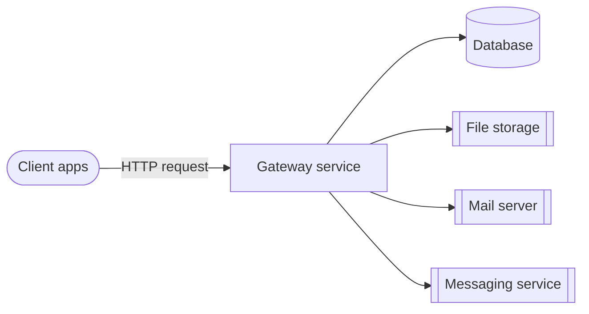

# Mesazon App

Mesazon is a business-management platform; features derive from real business needs.

## Architecture



Internal request flow:


Local build/run/test setup: [Repository setup](docs/repository-setup.md).
Recurring and resolved failure modes: [Known issues](agent-docs/known-issues.md).

## Documentation router

Read only the documents needed for the current change. For any feature change, first read its file in `agent-docs/features/`.

### New feature or endpoint

Start with [Feature flow](agent-docs/features/flow/README.md), then read only the current PR slice:

| Guide | Read when |
|---|---|
| [1. Endpoints](agent-docs/features/flow/01-endpoints.md) | Adding/changing Smithy or Tapir endpoints and their transport models, auth traits, errors, or API docs |
| [2. Validation](agent-docs/features/flow/02-validation.md) | Adding/changing validated domain models, newtypes, arbitraries, validators, or unit tests |
| [3. Schema](agent-docs/features/flow/03-schema.md) | Adding/changing migrations, tables, constraints, indexes, or table config only |
| [4. Repository](agent-docs/features/flow/04-repository.md) | Adding/changing persisted types, Rows, Queries, Repositories, codecs, or DB tests |
| [5. Service](agent-docs/features/flow/05-service.md) | Combining all layers into orchestration, endpoint implementation/wiring, functional tests, and acceptance tests |

Each slice guide links its technology standards.

### Exceptional changes

| Guide | Read when |
|---|---|
| [Authentication](agent-docs/project/authentication.md) | Changing middleware, auth/onboard/organization-role policy, `AuthState`, or transport security |
| [Alternate HTTP](agent-docs/project/alternate-http.md) | Changing Tapir/streaming endpoints, their docs, limits, or error model |
| [Streaming uploads](agent-docs/project/streaming-uploads.md) | Changing `FileScanner`/`ImageProcessing` byte handling, upload cap enforcement, or `EntityLimiter` interaction |
| [External client](agent-docs/project/external-client.md) | Adding/changing SMTP, S3, or outbound HTTP clients and dependency integration tests |
| [Database runtime](agent-docs/project/database-runtime.md) | Changing datasource/pool, transactor, SQL logging, or shared PostgreSQL test-client mechanics |
| [Build](agent-docs/project/build.md) | Changing sbt, dependencies, modules, tasks, Docker packaging, Scala/JDK, or CI |
| [Feature consolidation](agent-docs/project/feature-consolidation.md) | Moving an old feature to the current layout without behavior changes |
| [Acceptance testing](agent-docs/project/acceptance-testing.md) | Adding/reviewing real-gateway HTTP acceptance specs, `GatewayClient` test methods/codecs, shared acceptance harness wiring, organization middleware matrices, or rejected-side-effect assertions |

### Diagnostics

| Guide | Read when |
|---|---|
| [Known issues](agent-docs/known-issues.md) | Diagnosing CI, local runtime, container, HTTP transport, or flaky test failures; update it when a reusable failure signature and fix are established |

### Technology standards

Read every standard whose trigger matches the task:

| Standard | Read when |
|---|---|
| [Scala](agent-docs/standards/scala.md) | Writing, changing, reviewing, or testing Scala code, including naming and refactoring |
| [Smithy](agent-docs/standards/smithy.md) | Adding/changing Smithy endpoints, operations, transport models, traits, errors, or generated contracts |
| [Tapir](agent-docs/standards/tapir.md) | Adding/changing Tapir endpoints, streaming inputs, security, errors, or OpenAPI docs |
| [Iron](agent-docs/standards/iron.md) | Adding/changing refined newtypes, domain constraints, validation boundaries, or refined conversions/codecs |
| [PostgreSQL](agent-docs/standards/postgres.md) | Adding/changing migrations, tables, columns, types, constraints, indexes, or stored-data lifecycle |
| [Doobie](agent-docs/standards/doobie.md) | Adding/changing SQL queries, fragments, row codecs, repository DB effects, transactions, or pool wiring |
| [sbt](agent-docs/standards/sbt.md) | Adding/changing dependencies, modules, build settings/tasks/plugins, Scala/JDK versions, Docker build wiring, or CI commands |

### Agent configuration ownership

`.agents/` is canonical for shared agents, contracts, commands, and skills. `.claude/` is a real Claude-specific directory; each shared file inside it is a relative symlink to `.agents/`. Edit shared files in `.agents/`. Claude-only files/config stay directly under `.claude/`; to diverge one shared file, replace only its symlink. `.claude/settings.local.json` and `.claude/worktrees/` are local/gitignored.

## Validation flow (rules, run in order, every change)

1. **Feature doc first** — read the relevant `agent-docs/features/` file before coding. For a new feature, create `agent-docs/features/<feature-name>.md` in PR 1, link it under [Features](#features), and update its status/content in every slice. Never wait until the final PR. Required structure: scope/boundaries; endpoint auth/onboard/roles; flow/security/decisions; key files/config; unit/functional/integration/acceptance tests. See [Feature flow](agent-docs/features/flow/README.md).
2. **Standards compliance** — read the current slice or exceptional-change guide from the [documentation router](#documentation-router) and its linked technology standards.
3. **Tests in every PR** — write and pass the current slice's applicable tests; never defer them:
   - **Unit** `gateway/core/.../unit` — validators, pure helpers.
   - **Functional** `gateway/core/.../fun` — one service, effectful dependencies mocked.
   - **Integration** `gateway/core/.../it` — one repository/client vs a real dependency; no application HTTP.
   - **Acceptance** `gateway/it` — real gateway and dependencies over HTTP.
4. **Lint** — run `sbt "runLint"` before done. `checkLint` is the read-only CI gate.
5. **Docs currency** — every task fixes affected stale statements in `agent-docs/` and this file, including renamed errors, types, endpoints, config keys, and files. Document new conventions. A stale doc is worse than no doc.

## Project structure

- `backend/gateway/core` — gateway service: smithy, domain models, validators, services, repositories, unit+functional tests
- `backend/gateway/it` — acceptance tests (real gateway+Postgres, compose/testcontainers)
- `backend/domain` — shared domain models, newtypes (`Newtypes.scala`)
- `backend/test-kit` — shared test arbitraries, base specs
- `backend/schemas` — Flyway migrations (`migrations/`), local Postgres bootstrap (`local/`)
- `backend/clock`, `backend/generator` — shared utility modules
- `backend/postgresql-test`, `backend/s3-test`, `backend/wiremock` — test harnesses for their infra
- `backend/waha` — WhatsApp service (`core` + own `it` acceptance tests)
- `compose/` — local dev docker-compose stack
- `terraform/` — infra as code
- `docs/` — human-facing setup docs
- `agent-docs/` — concise LLM-facing feature, project, standards, and diagnostic instructions
- `.agents/{agents,contracts,commands,skills}/` — shared agent sources; `.claude/` holds per-file symlinks plus Claude-specific files/config

## Features

New feature → [Feature flow](agent-docs/features/flow/README.md); create/link its feature doc in PR 1 per [Validation flow §1](#validation-flow-rules-run-in-order-every-change).

- [User Onboarding](agent-docs/features/user-onboarding.md)
- [User Sign in](agent-docs/features/user-signin.md)
- [User Sign up](agent-docs/features/user-signup.md)
- [User Forgot Password](agent-docs/features/user-forgot-password.md)
- [User Token Management](agent-docs/features/user-token-management.md)
- [Organization Management](agent-docs/features/organization-management.md)
- [Customer Book](agent-docs/features/customer-book.md)
- [Catalogue](agent-docs/features/catalogue.md) — in progress; see its five-slice status

## Commands

Full detail: [Repository setup](docs/repository-setup.md).

```sh
sbt compile                                            # compiles all; smithy4s codegen auto-runs
sbt smithy4sCodegen                                     # smithy contract compiles standalone
sbt "checkLint"                                         # scalafix+scalafmt, check only
sbt "runLint"                                           # scalafix+scalafmt, autofix
sbt "gateway-build"                                     # CI alias: clean -> backend -> checkLint -> testFull
sbt "gateway-core/testOnly io.mesazon.gateway.fun.*"    # functional tests only, no containers
sbt "gateway-it/test"                                   # acceptance tests, needs Docker

sbt "gatewayCore/Docker/publishLocal"                   # build gateway image
docker compose -f compose/compose.yaml up -d            # local stack: postgres, flyway, gateway, mocks
```

`/feature "<description>"` — Product Owner → Engineering Manager → complexity-selected Lead Engineer (`LOW|MEDIUM|HIGH|EXTREME`). PO owns product requirements; EM resolves edge cases, maps docs/outcome slices, and applies the [complexity contract](.agents/contracts/complexity.md); the selected Lead follows the [Lead contract](.agents/contracts/lead-engineer.md) to design, implement, and verify. Sources: `.agents/`; Claude: per-file `.claude/` symlinks; Codex: `.codex/agents/`. Setup: [Agent pipeline](agent-docs/agent-pipeline-setup.md).
