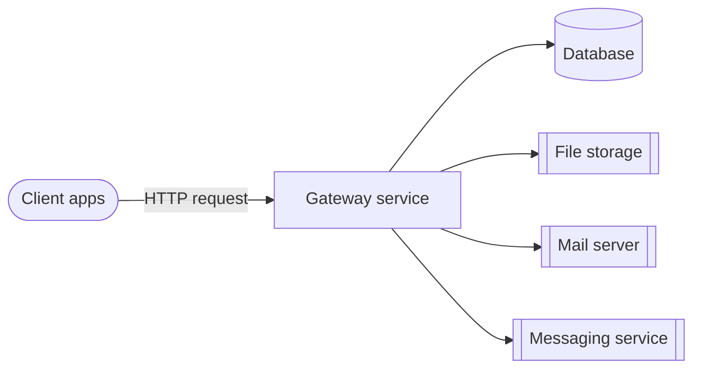
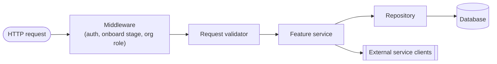

# Mesazon App

Mesazon is a Business Management Platform. Its goal is to enhance businesses with powerful tools to orchestrate their workflows, taking a pragmatic approach: features are derived from real business needs.

## Architecture



Internal request flow:



Local build/run/test setup: [Repository setup](docs/repository-setup.md).

## Tech stack

Standards per technology, in request-flow order. Follow when writing code.

- [smithy](docs-claude/stack/smithy.md) — API contracts: naming, coding standards, custom traits
- [middleware](docs-claude/middleware.md) — auth (basic/bearer), `@completedOnboardStage`, org role via `X-Organization-ID`
- [validators](docs-claude/validators.md) — smithy request → refined domain model; error accumulation
- [scala](docs-claude/stack/scala.md) — language conventions + test-writing standards
- [postgres](docs-claude/stack/postgres.md) — Flyway migrations, table/column naming, Row→Queries→Repository
- [tapir](docs-claude/stack/tapir.md) — streaming file-upload transport, error model, security parity with middleware
- [repository](docs-claude/repository.md) — Row→Queries→Repository layer: inputs vs API requests, transactions, id/timestamp gen, error mapping, wiring, testing
- [sbt](docs-claude/stack/sbt.md) — sbt 2.x rules, module structure, dependency mgmt, CI wiring

## Validation flow (rules, run in order, every change)

1. **Standards compliance** — must match [tech stack](#tech-stack) docs, not generic convention. New feature → [Adding a feature](docs-claude/adding-a-feature.md) order: smithy → domain models → validator → service → persistence.
2. **Lint** — `sbt "runLint"` (scalafix+scalafmt, autofix) before done. `checkLint` = check-only, CI-enforced.
3. **Tests** — write + pass at every applicable layer:
   - **Unit** `gateway/core/.../unit` — validators, pure helpers.
   - **Functional** `gateway/core/.../fun` — one service, all deps mocked. [functional-tests.md](docs-claude/functional-tests.md)
   - **Integration** `gateway/core/.../it` — repository/client vs real dependency (Testcontainers), no HTTP. [integration-tests.md](docs-claude/integration-tests.md)
   - **Acceptance** `gateway/it` module — real gateway + real Postgres over HTTP. [acceptance-tests.md](docs-claude/acceptance-tests.md)
4. **Feature docs** — check `docs-claude/features/` before coding. New feature → create `docs-claude/features/<feature-name>.md` at first slice (even schema-only), link under [Features](#features), include **Status**: done / remaining — update per slice, drop only when fully shipped+tested. See [Adding a feature § file layout](docs-claude/adding-a-feature.md#file-layout). Structure:
   - scope: owns / excludes / boundary links
   - endpoints table: auth + onboard stage
   - flow: incl. security/abuse defenses, non-obvious decisions
   - key files + config
   - tests: acceptance, functional, unit, integration
5. **Docs currency** — every task scans `docs-claude/` + this file for now-inaccurate statements (incl. renamed identifiers: errors, types, endpoints, config keys, files) and fixes them in the same change. New convention → document it. Stale doc > missing doc, in badness.

## Project structure

- `backend/gateway/core` — gateway service: smithy, domain models, validators, services, repositories, unit+functional tests
- `backend/gateway/it` — acceptance tests (real gateway+Postgres, compose/testcontainers)
- `backend/domain` — shared domain models, newtypes (`Newtypes.scala`)
- `backend/test-kit` — shared test arbitraries, base specs
- `backend/schemas` — Flyway migrations (`migrations/`), local Postgres bootstrap (`local/`)
- `backend/clock`, `backend/generator` — shared utility modules
- `backend/postgresql-test`, `backend/s3-test`, `backend/wiremock` — test harnesses for their infra
- `backend/waha` — WhatsApp service (`core` + own `it` acceptance tests)
- `compose/` — local dev docker-compose stack
- `terraform/` — infra as code
- `docs/` — human-facing setup docs
- `docs-claude/` — standards + feature docs (this file's links)
- `.claude/agents/`, `.claude/commands/` — `/feature` pipeline

## Features

New feature → [Adding a feature](docs-claude/adding-a-feature.md); doc requirement: [Validation flow §4](#validation-flow-rules-run-in-order-every-change).

- [User Onboarding](docs-claude/features/user-onboarding.md)
- [User Sign in](docs-claude/features/user-signin.md)
- [User Sign up](docs-claude/features/user-signup.md)
- [User Forgot Password](docs-claude/features/user-forgot-password.md)
- [User Token Management](docs-claude/features/user-token-management.md)
- [Organization Management](docs-claude/features/organization-management.md)
- [Files Management](docs-claude/features/files-management.md)
- [Customer Book](docs-claude/features/customer-book.md)
- [Catalogue](docs-claude/features/catalogue.md) — in progress (part 1: tables+schemas; part 2: repository layer)

## Commands

Full detail: [Repository setup](docs/repository-setup.md).

```sh
sbt compile                                            # compiles all; smithy4s codegen auto-runs
sbt smithy4sCodegen                                     # smithy contract compiles standalone
sbt "checkLint"                                         # scalafix+scalafmt, check only
sbt "runLint"                                           # scalafix+scalafmt, autofix
sbt "gateway-build"                                     # CI alias: clean -> backend -> checkLint -> testFull
sbt "gateway-core/testOnly io.mesazon.gateway.fun.*"    # functional tests only, no containers
sbt "gateway-it/test"                                   # acceptance tests, needs Docker

sbt "gatewayCore/Docker/publishLocal"                   # build gateway image
docker compose -f compose/compose.yaml up -d            # local stack: postgres, flyway, gateway, mocks
```

`/feature "<description>"` — 4-role subagent pipeline (Product Owner → Engineering Manager → Lead Engineer → Senior Engineer), defined in `.claude/agents/` + `.claude/commands/feature.md`. Requires OmniRoute (local model-routing gateway, per-machine setup, not shared infra): [Agent pipeline setup](docs-claude/agent-pipeline-setup.md).
