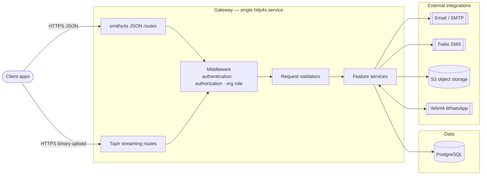
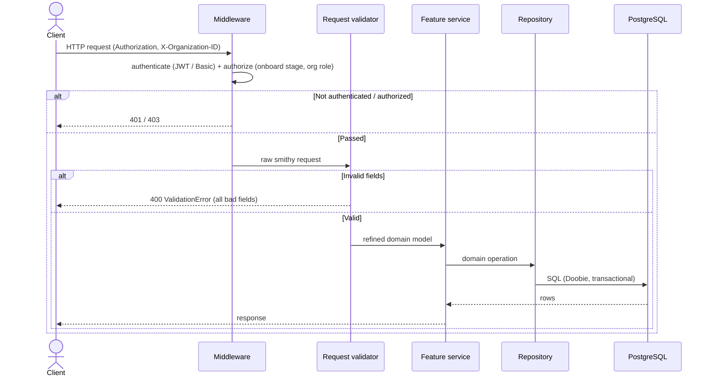
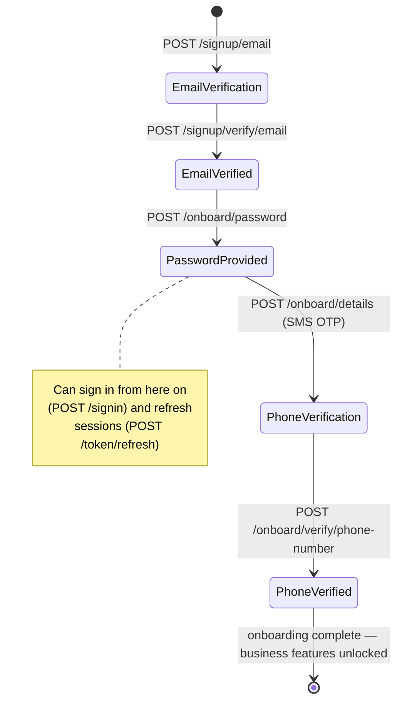
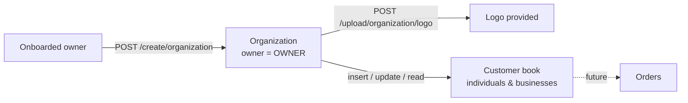
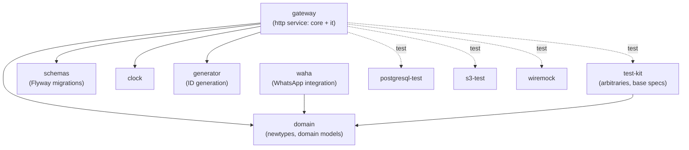

# Mesazon

**Mesazon is a business management platform** — a pragmatic toolbox that helps businesses orchestrate their day-to-day workflows. Features are driven by real business needs: onboarding an owner, standing up their organization, keeping a book of the customers they trade with, and (soon) the orders between them.

This repository holds the **backend**: a single HTTP gateway written in Scala, backed by PostgreSQL, with contracts defined in Smithy.

### Table of Contents

- [What it does](#what-it-does)
- [Architecture](#architecture)
- [Request lifecycle](#request-lifecycle)
- [The user journey](#the-user-journey)
- [Feature map](#feature-map)
- [Tech stack](#tech-stack)
- [Repository layout](#repository-layout)
- [Scala CI/CD](#scala-cicd)

## What it does

A business owner signs up with their email, sets a password, verifies their phone, and creates an **organization** (their tenant). From there they manage a **customer book** — the individuals and businesses they trade with — and upload assets such as a logo. Every request is authenticated, authorized against the caller's organization role, and validated into a strongly-typed domain model before any work happens.

## Architecture

One deployable gateway fronts every feature. Inbound requests pass through authentication/authorization middleware, are validated into refined domain models, handled by a per-feature service, and persisted to PostgreSQL. External effects (email, SMS, object storage, WhatsApp) are isolated behind clients.

- **Two transports, one service.** Most endpoints are Smithy operations served as JSON (2 MB limit). File uploads stream binary bodies through Tapir (20 MB), so images are never fully buffered in memory. Both share the same auth middleware and Swagger UI.
- **Auth at the edge.** A bearer access token (or HTTP Basic for sign-in) is verified in middleware, which resolves an `AuthedUser`, enforces the required onboarding stage, and checks the caller's role within the organization named by the `X-Organization-ID` header — before the handler runs. See [middleware](docs-claude/middleware.md).
- **Validation is a boundary.** Untrusted wire input becomes a refined domain model (Iron-refined newtypes) at exactly one place per feature; past it, illegal states are unrepresentable and every invalid field is reported at once. See [request validation](docs-claude/validators.md).

## Request lifecycle

## The user journey

Onboarding is a state machine on `OnboardStage`; completing it (`PhoneVerified`) unlocks the business features gated by `@completedOnboardStage`.

Once complete, the owner creates an organization and manages their customer book:

## Feature map

Each feature ships with its own design doc — scope, endpoints, per-endpoint sequence diagrams, and tests.

| Feature | What it owns | Doc |
|---|---|---|
| User Sign up | Email + OTP verification; creates the account shell | [user-signup](docs-claude/features/user-signup.md) |
| User Onboarding | Password → details → phone verification; the `OnboardStage` machine | [user-onboarding](docs-claude/features/user-onboarding.md) |
| User Sign in | Password auth over HTTP Basic, brute-force defense, session start | [user-signin](docs-claude/features/user-signin.md) |
| User Forgot Password | OTP-based password recovery with abuse defenses | [user-forgot-password](docs-claude/features/user-forgot-password.md) |
| User Token Management | JWT issuing, refresh-token rotation, revocation, bearer authorization | [user-token-management](docs-claude/features/user-token-management.md) |
| Organization Management | The tenant entity, membership/roles, creation | [organization-management](docs-claude/features/organization-management.md) |
| Customer Book | The client's address book of individuals and businesses | [customer-book](docs-claude/features/customer-book.md) |
| Files Management | Streaming uploads, scanning, image processing, S3 storage | [files-management](docs-claude/features/files-management.md) |

## Tech stack

| Area | Choice | Notes |
|---|---|---|
| Language | **Scala 3** | ZIO effects, cats `Validated` for error accumulation, Iron refined types |
| Build | **sbt 2.x** | multi-module; Smithy codegen wired into compile |
| API contracts | **Smithy** (smithy4s) | source of truth for JSON operations; shared Swagger UI |
| Streaming transport | **Tapir** on http4s | binary uploads alongside the Smithy routes |
| Persistence | **PostgreSQL** | Doobie + Tranzactio; Flyway migrations; `Row → Queries → Repository` |
| Integrations | Email/SMTP, Twilio SMS, S3, WAHA (WhatsApp) | each behind a client, mockable in tests |

Conventions for each are documented under [`docs-claude/`](docs-claude/) ([scala](docs-claude/scala.md), [sbt](docs-claude/sbt.md), [smithy](docs-claude/smithy.md), [postgres](docs-claude/postgres.md)).

## Repository layout

The backend is a set of small, single-responsibility sbt modules.

Contributor guides — coding standards, how a feature is structured, and how the test tiers work — live in [`docs-claude/`](docs-claude/): start with [adding-a-feature](docs-claude/adding-a-feature.md) and [acceptance-tests](docs-claude/acceptance-tests.md).

## Scala CI/CD

For Scala CI/CD, we aim for a streamlined process designed to minimize the steps required to deploy new features/fixes to production while mitigating major risks. The process is outlined below:

