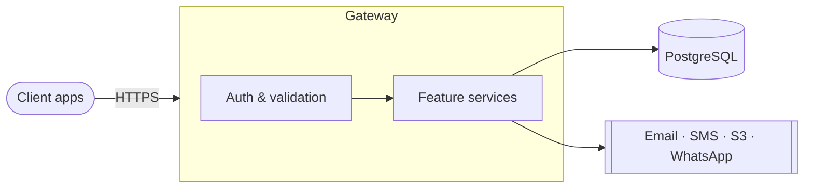
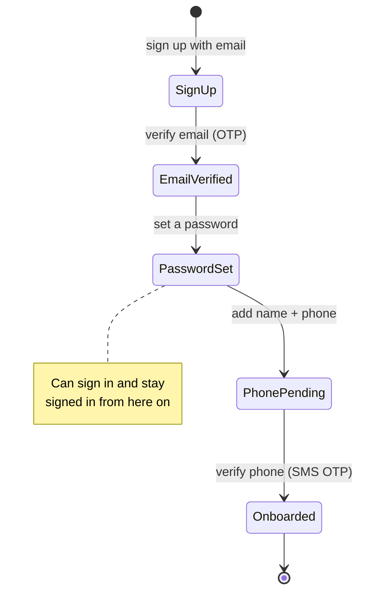
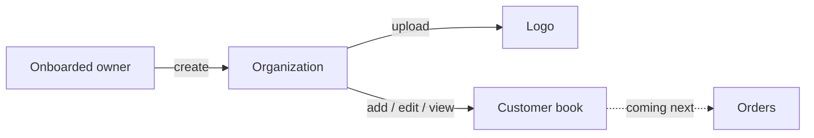

# Mesazon

**Mesazon is a business management platform** — a pragmatic toolbox that helps businesses run their day-to-day workflows.

A business owner signs up, verifies their email and phone, and creates their **organization**. From there they keep a **customer book** of the people and companies they trade with, upload assets like a logo, and (soon) manage the orders between them.

This repo is the **backend**: one HTTP gateway in Scala, backed by PostgreSQL, with API contracts defined in Smithy.

## How it fits together

One gateway fronts every feature. A request is authenticated and authorized, validated into a strongly-typed model, handled by a feature service, and saved to PostgreSQL. Email, SMS, file storage, and WhatsApp live behind their own clients.

## The workflow

Getting started is a short, guided path. Finishing it unlocks the business features.

Once onboarded, the owner creates an organization and manages their customer book:

## Features

Each feature has its own short design doc — what it does, its endpoints, sequence diagrams, and tests.

| Feature | What it does |
|---|---|
| [Sign up](docs-claude/features/user-signup.md) | Create an account and verify the email |
| [Onboarding](docs-claude/features/user-onboarding.md) | Set a password, add details, verify the phone |
| [Sign in](docs-claude/features/user-signin.md) | Log in with email + password |
| [Forgot password](docs-claude/features/user-forgot-password.md) | Recover a lost password |
| [Tokens](docs-claude/features/user-token-management.md) | Keep sessions alive and revocable |
| [Organization](docs-claude/features/organization-management.md) | The tenant, its members and roles |
| [Customer book](docs-claude/features/customer-book.md) | The address book of customers |
| [Files](docs-claude/features/files-management.md) | Uploads, image processing, storage |

## Built with

**Scala 3** · **PostgreSQL** · **Smithy** (API contracts) · **sbt**. Integrations: email, Twilio SMS, S3, WhatsApp.

Deeper docs for contributors live in [`docs-claude/`](docs-claude/) — start with [adding a feature](docs-claude/adding-a-feature.md).

## Scala CI/CD

A streamlined pipeline that keeps the steps to ship a change to production small while mitigating the major risks:

