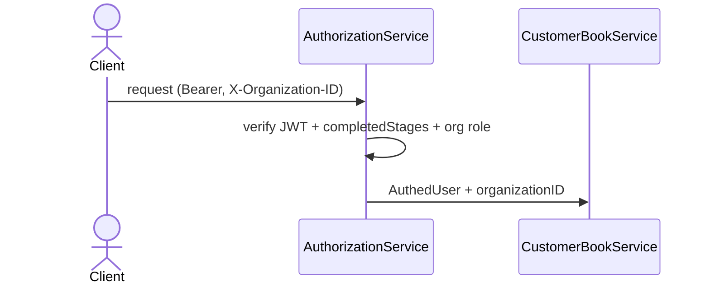
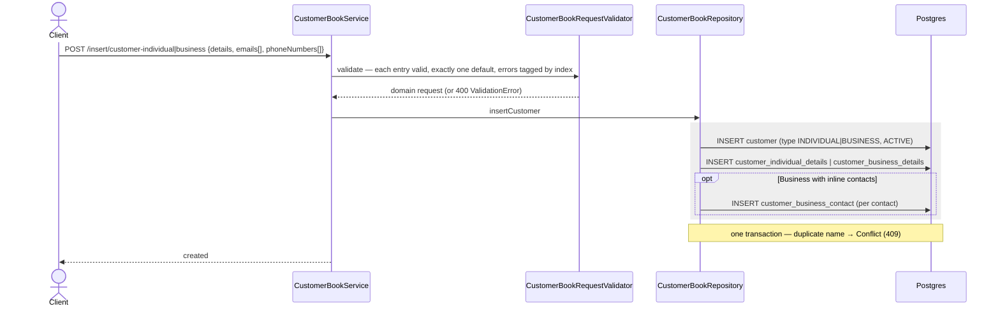
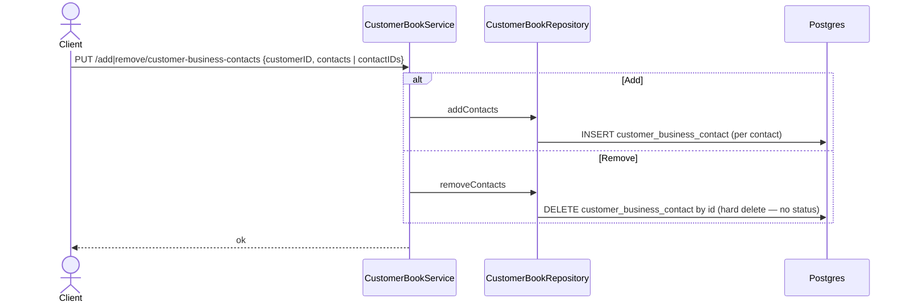
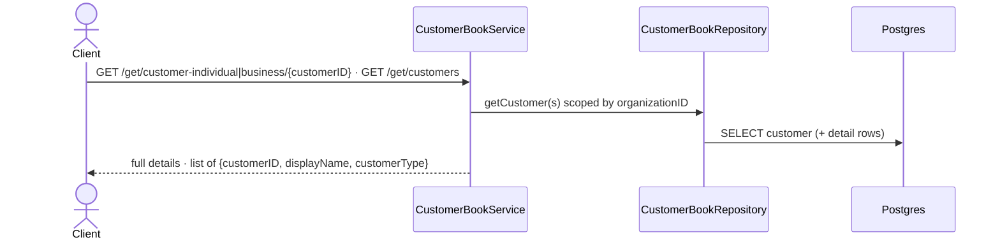

# Customer Book

Owns the client's address book of the people and companies they do business with. One parent entity, discriminated into two kinds, plus a child table:

- **Customer** (`customer`) — the *party an order is billed to* (PK `(organization_id, customer_id)`, `customer_type` `INDIVIDUAL`/`BUSINESS`, `status`). Every order (a later feature) targets a `customer_id`. This is the only order target — there is no separate "counterparty".
- **Individual details** (`customer_individual_details`) — 1:1 with an `INDIVIDUAL` customer (the person's `full_name`, contact, address).
- **Business details** (`customer_business_details`) — 1:1 with a `BUSINESS` customer (`business_name`, `tax_id`, contact, address).
- **Business contacts** (`customer_business_contact`) — **0-to-many** people *within* a business (`customer_business_contact_id`, `full_name`, `role`, contact). A contact is **not** a customer: it has no `customer_id` of its own and is never an order target.

**Vocabulary (read this first).** "Organization" in this codebase is the **Mesazon tenant** (the client themselves — see [Organization Management](organization-management.md)); it is *not* the customer's company. Every row here is scoped by `organization_id` (the tenant), carried in the `X-Organization-ID` header on every endpoint.

**Scope**: the `customer` parent, its two detail tables, business contacts, and the `INDIVIDUAL`/`BUSINESS` distinction (the `status`/archival column exists but is not yet exposed by any endpoint). **Excludes** orders (a future feature that will FK `customer_id` and snapshot buyer details — see the order-snapshot rules in [postgres.md](../postgres.md#soft-delete--archival)) and the tenant/membership/role model ([Organization Management](organization-management.md)).

## Data model

```
customer (organization_id, customer_id)  PK
  customer_type  INDIVIDUAL | BUSINESS
  status         ACTIVE | ARCHIVED
    ▲                        ▲                          ▲
    │ 1:1 (INDIVIDUAL)       │ 1:1 (BUSINESS)           │ 0:N (BUSINESS)
    │                        │                          │
customer_individual_details  customer_business_details  customer_business_contact
  full_name                    business_name              (org_id, customer_id,
  emails[], phones[] (jsonb)   tax_id                      customer_business_contact_id) PK
  address                      emails[], phones[] (jsonb)  full_name, role, email, phone
                               address
```

**Individual and business details hold *lists* of emails and phone numbers** (`emails` / `phone_numbers` `jsonb` columns), not a single one — a customer can have many, and each entry carries an `isDefault` flag marking the primary one. A **non-empty** email or phone list must mark **exactly one** entry as default (zero or several is a `ValidationError`); an empty list is allowed. A **business contact** still carries a single `email`/`phone` (the columns on `customer_business_contact` are unchanged). The domain models mirror this: `InsertCustomerIndividualPostRequest`/`InsertCustomerBusinessPostRequest` (and their update variants) carry `emails: List[CustomerEmailEntryRequest]` and `phoneNumbers: List[CustomerPhoneNumberEntryRequest]`, where each entry is `(CustomerEmail|CustomerPhoneNumber, isDefault: Boolean)`; the contact models keep `email: Option[...]`/`phoneNumber: Option[...]`.

**List validation accumulates, tagged by index.** When validating a list — the emails/phones of one customer, the contacts of a business, or a whole batch of customers to insert/update — the validator validates **every** item and accumulates all failures (it does *not* fail fast). Each `InvalidFieldError` carries the `index` of the offending item in its list. For a **batch of customers** each failed customer's errors are wrapped into a single error on the batch field (`customerIndividuals`/`customerBusinesses`): its message lists the customer's invalid fields (with their own inner email/phone indexes intact) and its `index` points at the customer in the batch — so an email index is never mistaken for a customer index.

Each detail/child table FKs the parent on the composite `(organization_id, customer_id)`, so a detail row can only ever attach to a customer **in the same tenant**. `status` lives on the parent `customer` only — the detail rows inherit it.

### Individual vs business

A customer is one of two kinds, discriminated by `customer_type` (see [postgres.md § Customer type](../postgres.md#customer-type--individual-vs-business)):

- **`INDIVIDUAL`** — a standalone person. Its identity/contact live in `customer_individual_details`.
- **`BUSINESS`** — a named company account. Its details live in `customer_business_details`, and it may own any number of `customer_business_contact` people.

Which detail table holds a customer's row is determined by `customer_type` and kept consistent **at the application layer** (not a DB `check` or FK trick, consistent with this schema staying permissive at the DB): the service inserts `customer` + the matching detail table in one transaction and never the other, and an integration test asserts no `customer_id` is ever present in both detail tables. See [postgres.md § Customer type](../postgres.md#customer-type--individual-vs-business).

### Why contacts are not customers

A **business contact** is a point of contact inside a company (a buyer, an accountant), not a party orders are billed to. Modelling them as child rows of the business — rather than as `customer` rows — keeps the order target unambiguous (always a `customer_id`) and means a contact carries no `status` and no lifecycle of its own: it lives and dies with its business. `customer_business_contact` FKs `customer_business_details` (not `customer`), so a contact can only ever hang off a customer that has a business-details row — i.e. a `BUSINESS`. An `INDIVIDUAL` can never acquire contacts; the DB rejects it. This replaced an earlier `counterparty`/`counterparty_customer` design where business members were themselves customers pointed at a shared counterparty.

## Endpoints

One service — `CustomerBookService`, `@completedOnboardStage` (Bearer + completed onboarding). Every operation requires the `X-Organization-ID` header, declared once via the `OrganizationScopedInput` mixin (see [smithy.md §4](../smithy.md#4-organization-scoping--the-x-organization-id-header)). Operation names split by *what* they act on — `CustomerIndividual` (a standalone person) or `CustomerBusiness` (a company) — rather than one polymorphic insert, so each carries its own validator and swagger entry and its side effects are legible from the name. Inserts come in a **singular** and a **batch** (plural) form, plus a **combined** `InsertCustomersPost` that takes both individuals and businesses in one payload. Roles follow the project-wide policy (see [smithy.md § Role policy](../smithy.md#organizationuserrolesallowedroles-)): the three **GET** reads allow `OWNER`/`ADMIN`/`USER`; every write (insert/update/add/remove) allows `OWNER`/`ADMIN` only — a `USER` can view the customer book but not modify it. URIs follow the action-first style of [Organization Management](organization-management.md) (no feature prefix — that's reserved for multi-step flows like `/onboard`, `/signup`). Most writes can return `Conflict` (409) — e.g. a duplicate customer — and `ValidationError` (400). **`RemoveCustomerBusinessContactsPut` is the exception: its smithy errors are `[BadRequest, Unauthorized, Forbidden, InternalServerError]` only** (same set as the reads). It declares no `ValidationError` — its request carries only UUIDs (`customerID` + contact IDs) whose refinement is `Pure` and cannot fail — and no `Conflict`, because removal is a pure `DELETE` that can never violate a unique constraint. Every operation additionally carries the four middleware errors (`BadRequest` for a missing `X-Organization-ID`, `Unauthorized`, `Forbidden`, `InternalServerError`); the reads carry exactly those four (no body to validate, nothing written to conflict).

**Reads**

| Method | Path | Operation | Returns |
|---|---|---|---|
| GET | `/get/customer-individual/{customerID}` | `GetCustomerIndividualGet` | one individual's full details |
| GET | `/get/customer-business/{customerID}` | `GetCustomerBusinessGet` | one business's full details |
| GET | `/get/customers` | `GetCustomersGet` | every customer as `customerID` + `displayName` + `customerType` (individuals and businesses in one list) |

**Individuals** (standalone people)

| Method | Path | Operation | Effect |
|---|---|---|---|
| POST | `/insert/customer-individual` | `InsertCustomerIndividualPost` | new individual (a `customer` of type `INDIVIDUAL` + its details row) |
| POST | `/insert/customer-individuals` | `InsertCustomerIndividualsPost` | batch of the above |
| PUT | `/update/customer-individual` | `UpdateCustomerIndividualPut` | edit an individual's details |

**Businesses** (company accounts)

| Method | Path | Operation | Effect |
|---|---|---|---|
| POST | `/insert/customer-business` | `InsertCustomerBusinessPost` | new `BUSINESS` account (+ optional inline contacts) |
| POST | `/insert/customer-businesses` | `InsertCustomerBusinessesPost` | batch of the above |
| PUT | `/update/customer-business` | `UpdateCustomerBusinessPut` | edit a company's details |

**Combined**

| Method | Path | Operation | Effect |
|---|---|---|---|
| POST | `/insert/customers` | `InsertCustomersPost` | insert individuals **and** businesses in one payload |

**Business contacts** (people within a business)

| Method | Path | Operation | Effect |
|---|---|---|---|
| PUT | `/add/customer-business-contacts` | `AddCustomerBusinessContactsPut` | add contacts to a business (`customerID` + contacts) |
| PUT | `/remove/customer-business-contacts` | `RemoveCustomerBusinessContactsPut` | remove contacts from a business (`customerID` + `customerBusinessContactID`s) |

Smithy: `backend/gateway/core/src/main/smithy/CustomerBookService.smithy` (+ `domain/CustomerBook.smithy`). Per smithy.md §4 each operation owns its item structures (`InsertCustomerIndividualPostRequest`, `AddCustomerBusinessContact`, …) — none are shared.

## Lifecycle

### Create individuals (`InsertCustomerIndividualPost`, `InsertCustomerIndividualsPost`)
For each person, in **one transaction**: insert a `customer` row (`customer_type = INDIVIDUAL`, `status = ACTIVE`), then its `customer_individual_details` row. The batch form repeats this per item; the combined `InsertCustomersPost` does it for its `customerIndividuals`.

### Create businesses (`InsertCustomerBusinessPost`, `InsertCustomerBusinessesPost`)
For each company, in **one transaction**: insert a `customer` row (`customer_type = BUSINESS`, `status = ACTIVE`), then its `customer_business_details` row. Any inline `customerBusinessContacts` on the request are inserted as `customer_business_contact` rows in the same transaction; more can be added later via the contact endpoints.

### Manage business contacts (`AddCustomerBusinessContactsPut`, `RemoveCustomerBusinessContactsPut`)
Contacts are child rows keyed by `(organization_id, customer_id, customer_business_contact_id)`. Both operations carry the owning business's `customerID` and operate on `customer_business_contact` rows under it: add appends new contacts, remove deletes them by `customerBusinessContactID`. Because a contact is not an order target and carries no `status`, **remove is a real row removal**, not a soft delete.

### Edit (`UpdateCustomerIndividualPut`, `UpdateCustomerBusinessPut`)
Edit a person's contact details or a company's details in place. These touch only the entity's own detail row.

### Archival
`customer.status` (`ACTIVE`/`ARCHIVED`) exists in the schema for the eventual soft-delete of a customer (orders reference `customer_id`, so a customer is never hard-deleted — see [postgres.md § Soft-delete & archival](../postgres.md#soft-delete--archival)). **No delete/archive endpoint is exposed yet** — the current surface only creates, edits, and reads.

## Security / design decisions

- **Org isolation via composite keys.** Every table is PK'd/keyed on `(organization_id, ...)` and each detail/child table FKs the parent on the composite `(organization_id, customer_id)` — Postgres matches an FK by column set, so a detail or contact row can only ever attach to a customer **in the same tenant**. A caller cannot reference another org's customer.
- **Never hard-delete a customer.** `customer` rows are archived, not deleted; orders (future) FK the customer with `on delete restrict` as a belt-and-suspenders guard. Contacts, which carry no orders, are hard-deleted.
- **`customer_type` drives which detail table applies, enforced in the service.** The DB stays permissive for the individual-vs-business split (a plain `(organization_id, customer_id)` FK from each detail table to `customer`). The service guarantees a customer is never both kinds by writing `customer` + the matching detail table in one transaction and never the other; an integration test backstops this by asserting no `customer_id` appears in both `customer_individual_details` and `customer_business_details`. The discriminated-composite-FK alternative was considered and rejected to keep the DB permissive. (The related "contacts only under a business" rule *is* DB-enforced — `customer_business_contact` FKs `customer_business_details`.)
- **Uniqueness is DB-enforced and mapped to a clear 409.** Four named `unique` constraints guard the customer book, and the repository translates each violation (Postgres `23505`) to `ServiceError.ConflictError.UniqueConstraintViolation` with a message naming the broken rule (see [repository.md § Error handling](../repository.md#error-handling) and [postgres.md § constraint naming](../postgres.md#constraint-naming--conflict-mapping)):
  - `uq_customer_individual_details_full_name` / `uq_customer_business_details_business_name` — `unique (organization_id, <name>)`: a tenant can't hold two individuals (or two businesses) with the same name → *"A customer with the given full/business name already exists in this organization"*.
  - `uq_customer_business_contact_email` / `uq_customer_business_contact_phone_number` — `unique (organization_id, customer_id, email)` and `... phone_number_e164`: within one business, no two contacts may share an email or a phone number → *"A business contact with the given email/phone number already exists for this customer"*. (`email`/`phone_number_e164` are nullable, and Postgres allows many NULLs, so contacts without an email/phone don't collide.)
  All uniqueness is scoped by `organization_id`, so the same name/email/phone may exist in different organizations.

## Sequence diagrams

Every operation is Bearer + completed-onboarding authenticated, scoped by the `X-Organization-ID` header, and role-checked (writes: `OWNER`/`ADMIN`; reads: `OWNER`/`ADMIN`/`USER`) — the auth/role step is drawn once here and omitted from the per-operation diagrams.



### Create an individual / business (`InsertCustomerIndividualPost`, `InsertCustomerBusinessPost`, batches, combined)



### Add / remove business contacts (`AddCustomerBusinessContactsPut`, `RemoveCustomerBusinessContactsPut`)



### Reads (`GetCustomerIndividualGet`, `GetCustomerBusinessGet`, `GetCustomersGet`)



## Key files

- Smithy: `smithy/CustomerBookService.smithy`, `smithy/domain/CustomerBook.smithy`
- Service: `service/CustomerBookService.scala`
- Repository: `repository/CustomerBookRepository.scala` (trait + input models), `repository/domain/Customer*Row.scala`, `repository/domain/CustomerSummaryRow.scala`
- Migration: `backend/schemas/migrations/V2025.05.27__init.sql` (`customer`, `customer_individual_details`, `customer_business_details`, `customer_business_contact`)

### Repository input models (why the repo doesn't take `...Request` types)

`CustomerBookRepository` does **not** accept the smithy-derived `...PostRequest`/`...PutRequest` domain models — those are API-transport vocabulary and must not reach the persistence boundary (the same reason `createOrganization` takes flat params, never `CreateOrganizationPostRequest`). Instead the repo owns its input case classes in its **companion object** (`InsertCustomerIndividualInput`, `InsertCustomerBusinessInput`, and nested `CustomerEmailEntryInput` / `CustomerPhoneNumberEntryInput` / `CustomerBusinessContactInput`), and `CustomerBookService` maps validated request → input with **Chimney**. An input class exists only to serve a **batch**: the batch takes `List[…Input]` and the singular insert reuses the same element class; single-only operations (the two updates, remove-contacts) take **flat params** and get no class. The full rule lives in [scala.md §5b Repository input models](../scala.md#5b-repository-input-models-decoupling-the-repo-from-the-api-contract).

The same rule reaches the persisted shape: the detail `Row`s type their `emails`/`phone_numbers` `jsonb` columns as `List[CustomerEmailEntryInput]` / `List[CustomerPhoneNumberEntryInput]`, **not** the smithy `...EntryRequest` models — so the whole stack (input → `Row` field → jsonb codec, the named `customerEmailEntryInputsMeta` givens in `CustomerBookQueries`) speaks one type and the repo does no `Input → Request` conversion. `CustomerBookQueries` therefore imports `CustomerBookRepository.*` and `io.github.iltotore.iron.jsoniter.given` for those codecs.

`GetCustomersGet` returns a projection, not a table row — `CustomerSummaryRow(customerID, displayName, customerType)`, where `displayName` is the new `CustomerDisplayName` refined type resolved from `full_name` (INDIVIDUAL) or `business_name` (BUSINESS). The list arrives **sorted case-insensitively by `displayName`** (see the query note below).

## Open design decisions

- **No archive/delete endpoint yet.** `customer.status` supports soft-delete, but no operation exposes it. When one is added, decide what happens to a business's contacts on archive (removed vs left in place).
- **Overlap between the singular/batch/combined inserts.** `InsertCustomerIndividualPost`, `InsertCustomerIndividualsPost`, and `InsertCustomersPost` can all create individuals; keep all three or converge once client needs are clear.

## Implementation status

The feature is **implemented end-to-end** except for its acceptance spec:

- Schema and the full smithy contract are in place (12 operations).
- `CustomerBookService.scala` is fully implemented: each handler validates via `CustomerBookRequestValidator`, Chimney-maps the validated request to the repository input (`request.transformInto[…Input]`), calls `CustomerBookRepository`, and maps `Row`s to smithy responses by hand (`.value` unwrapping; `customerTypeFromDomainToSmithy` in `service/service.scala` converts the enum). The two updates always pass `Some(emails)`/`Some(phoneNumbers)` (the smithy contract requires those lists, so an update always overwrites them) while the optional scalar fields pass through as `…OptUpdate` (absent → unchanged). The single-item GETs treat a missing customer as `InternalServerError.UnexpectedError` (the smithy operations declare no 404, matching the error matrix's "referenced entity missing → 500").
- Wiring is live: `Main` provides `CustomerBookService.live`, `CustomerBookRepository.live`, `CustomerBookQueries.live`, and `CustomerBookRequestValidator.live`; `HttpApp.externalSmithyRoutes` serves the routes.
- The full persistence stack **is built and tested**: `Row` models, `CustomerBookRepository` trait + `CustomerBookRepositoryImpl` + `live` (with its companion-object input models, see above), the single `CustomerBookQueries` class (all four tables), `RepositoryConfig` + both `application.conf`s, and `CustomerBookRepositorySpec` (green against real Postgres — see below).

### Batch inserts are atomic (one transaction), and efficient

`CustomerBookQueries` exposes **multi-row** `insert…Rows` (a single `INSERT … VALUES (…),(…),…`), so a batch of N customers is one statement per table, not N. The repository runs each batch (and the combined `insertCustomers`) in a **single `transactionOrWiden`** — so a batch is **all-or-nothing**: one duplicate-name conflict rolls the whole batch back to `Conflict`. (This supersedes the earlier "per-item transaction" reading; atomic is both more efficient and the safer default. The `CustomerBookRepositorySpec` duplicate-name test asserts the rollback.) Ids and timestamps are minted in the repository; the summary read (`getCustomerSummaryRows`) is a `customer ⟕ both detail tables` join filtered `status = Active`, **sorted case-insensitively by display name** (`ORDER BY LOWER(COALESCE(full_name, business_name)), customer_id` — the id tiebreak keeps the order deterministic). Sorting happens in SQL, not the service: the rows are already narrowed by the indexed `organization_id`, and a DB-side order is pagination-ready. "By type" is deliberately not the sort key — a client wanting businesses first filters on `customerType`.

**No index serves this sort, by design, and that's fine.** The key is `LOWER(COALESCE(cid.full_name, cbd.business_name))` — a function over a value COALESCE'd across two joined tables — which no single-table index can cover, so the planner always adds a Sort node. A `DESC` index would not help either (the sort is ASC, and a b-tree is scanned backward for `DESC` anyway; DESC indexes only matter for mixed-direction multi-key sorts). Every *other* access path — the `organization_id` filter, both detail joins, the FK checks, the uniqueness checks — is already served by the composite PKs/unique indexes (all lead with `(organization_id, customer_id …)`), so **no new index is warranted**. The only way to make this sort index-served is to denormalize a `display_name` column onto `customer` and index `(organization_id, lower(display_name))`; that carries sync-on-update cost and is **deferred** until `getCustomers` is paginated and large-per-tenant.

## Tests

- **Repository integration** — `it/CustomerBookRepositorySpec` (real Postgres): every repository operation's happy and failure paths, including the four unique-constraint conflicts and batch rollback.
- **Validator unit** — `unit/validation/service/CustomerBookRequestValidatorSpec`: one section per `validated…` method, error accumulation and index tagging.
- **Service functional** — `fun/CustomerBookServiceSpec` (mocked `CustomerBookRepository`, real validator): one section per operation; each happy path proves the exact repository call (organization scoping, Chimney-mapped inputs, update `Opt`/`Some` semantics) and the response mapping, and each failure path proves either a `ValidationError` that never reaches the repository or a repository error (conflict/500) propagating unchanged.
- **Acceptance** — `it/CustomerBookApiSpec` in `backend/gateway/it` (see [acceptance-tests.md](../acceptance-tests.md)), the reference implementation of the mandatory middleware-gate matrix. Each endpoint's `should` block runs the happy path (with full DB-state assertions) plus **every** applicable gate — `400` validation, `400` missing `X-Organization-ID`, `401` missing/invalid token, `403` disallowed onboard stage, `403` disallowed org role (writes only; reads allow all three roles), `500` no user-details row, `500` not-an-org-member — on top of the endpoint's own `409` conflicts (business name, and the contact email/phone uniqueness on the business inserts) and, for the by-id reads, a `500` when the customer is absent. Done so far: `insert/customer-individual`, `insert/customer-individuals`, `insert/customer-business`, `insert/customer-businesses`, and all three reads (`get/customer-individual`, `get/customer-business`, `get/customers`). Still to add: `insert/customers`, the two updates, and add/remove contacts.

**Type-exclusivity integration test (required).** Because the individual/business split is enforced only in the service, add a repository integration test that guards the invariant directly against Postgres: after exercising the insert paths, assert that no `customer_id` exists in both `customer_individual_details` and `customer_business_details`. This is the safety net that replaces a DB-level constraint — without it, a future code path could silently create a customer that is both kinds. (The "contacts only under a business" and per-tenant unique-name rules are already DB-enforced, so they need only ordinary happy-path/duplicate-conflict coverage, not a dedicated invariant sweep.)
