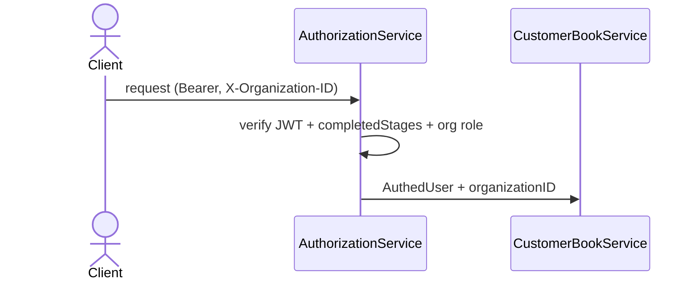
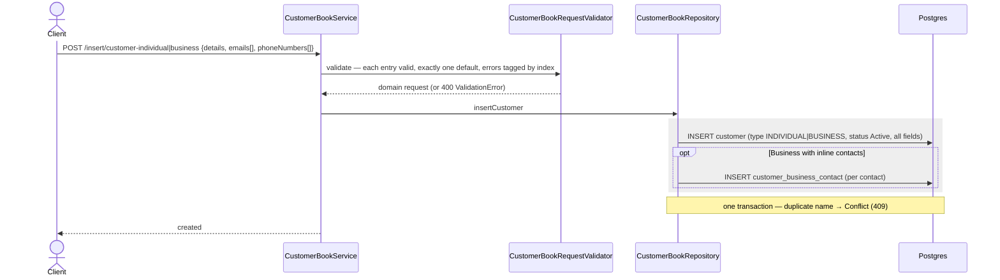
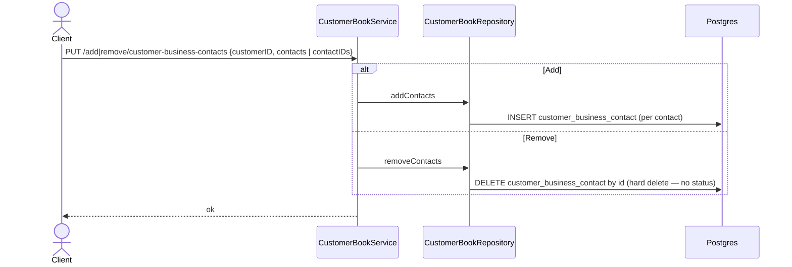
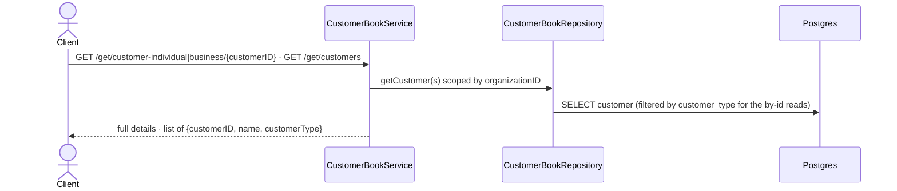
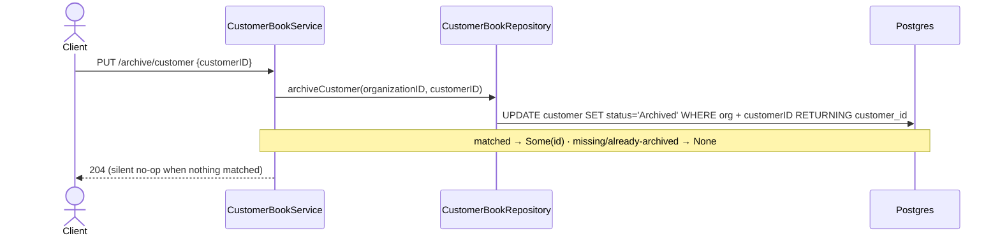

# Customer Book

Owns the client's address book of the people and companies they do business with. One table, discriminated into two kinds, plus a child table:

- **Customer** (`customer`) — the *party an order is billed to* (PK `(organization_id, customer_id)`, `customer_type` `INDIVIDUAL`/`BUSINESS`, `status`). **All customer fields live on this one table**: the shared `name` (a person's full name or a company name), `emails`/`phone_numbers`, address, and — for a `BUSINESS` — `tax_id` (null for individuals). Every order (a later feature) targets a `customer_id`. This is the only order target — there is no separate "counterparty".
- **Business contacts** (`customer_business_contact`) — **0-to-many** people *within* a business (`customer_business_contact_id`, `full_name`, `role`, contact). A contact is **not** a customer: it has no `customer_id` of its own and is never an order target.

The repository exposes two typed row views over the single table — `CustomerIndividualDetailsRow` (`fullName`, no `taxID`) and `CustomerBusinessDetailsRow` (`businessName`, `taxID`) — each selecting a `customer_type`-filtered subset of columns, with the stored `name` surfaced as `fullName`/`businessName`. There is no `CustomerRow`.

**Vocabulary (read this first).** "Organization" in this codebase is the **Mesazon tenant** (the client themselves — see [Organization Management](organization-management.md)); it is *not* the customer's company. Every row here is scoped by `organization_id` (the tenant), carried in the `X-Organization-ID` header on every endpoint.

**Scope**: the `customer` table, business contacts, the `INDIVIDUAL`/`BUSINESS` distinction, and archival (soft-delete via the `status` column, exposed by `ArchiveCustomerPut`; there is deliberately **no unarchive** endpoint). **Excludes** orders (a future feature that will FK `customer_id` and snapshot buyer details — see [historical-data rules](../standards/postgres.md#historical-data)) and the tenant/membership/role model ([Organization Management](organization-management.md)).

## Data model

```
customer (organization_id, customer_id)  PK
  customer_type  INDIVIDUAL | BUSINESS        (text)
  name                                        (person's full name OR company name)
  emails[], phone_numbers[] (jsonb)
  tax_id                                      (BUSINESS only; null for INDIVIDUAL)
  address
  status         customer_status enum: Active | Archived
    │
    │ 0:N (BUSINESS)
    ▼
customer_business_contact
  (org_id, customer_id, customer_business_contact_id) PK
  full_name, role, email, phone
  FK (org_id, customer_id) → customer
```

Individual and business customers share the single `customer` table, told apart by `customer_type`; `tax_id` is populated only for businesses. `status` is a **PostgreSQL enum** (`customer_status`) rather than free text — its labels (`Active`/`Archived`) are the Scala `CustomerStatus` case names verbatim (see [persistence queries](flow/04-repository.md#queries) for the required casts).

**Customers hold *lists* of emails and phone numbers** (`emails` / `phone_numbers` `jsonb` columns on `customer`), not a single one — a customer can have many, and each entry carries an `isDefault` flag marking the primary one. A **non-empty** email or phone list must mark **exactly one** entry as default (zero or several is a `ValidationError`); an empty list is allowed. A **business contact** still carries a single `email`/`phone` (the columns on `customer_business_contact` are unchanged). The domain models mirror this: `InsertCustomerIndividualPostRequest`/`InsertCustomerBusinessPostRequest` (and their update variants) carry `emails: List[CustomerEmailEntryRequest]` and `phoneNumbers: List[CustomerPhoneNumberEntryRequest]`, where each entry is `(CustomerEmail|CustomerPhoneNumber, isDefault: Boolean)`; the contact models keep `email: Option[...]`/`phoneNumber: Option[...]`.

**List validation accumulates, tagged by index.** When validating a list — the emails/phones of one customer, the contacts of a business, or a whole batch of customers to insert/update — the validator validates **every** item and accumulates all failures (it does *not* fail fast). Each `InvalidFieldError` carries the `index` of the offending item in its list. For a **batch of customers** each failed customer's errors are wrapped into a single error on the batch field (`customerIndividuals`/`customerBusinesses`): its message lists the customer's invalid fields (with their own inner email/phone indexes intact) and its `index` points at the customer in the batch — so an email index is never mistaken for a customer index.

The `customer_business_contact` child table FKs the parent on the composite `(organization_id, customer_id)`, so a contact can only ever attach to a customer **in the same tenant**.

### Individual vs business

A customer is one of two kinds, discriminated by `customer_type` (see [discriminated subtypes](../standards/postgres.md#discriminated-subtypes)):

- **`INDIVIDUAL`** — a standalone person. Its `name` is the person's full name; `tax_id` is null.
- **`BUSINESS`** — a named company account. Its `name` is the company name, it may carry a `tax_id`, and it may own any number of `customer_business_contact` people.

Both kinds are rows in the same `customer` table. Reads (`getCustomerIndividual`/`getCustomerBusiness`) and typed updates **filter by `customer_type`**, so requesting the wrong kind for a `customer_id` returns `None` — the same "not found" behaviour the two-table design gave for free. A customer is inherently one kind (one row, one `customer_type`), so it can never be both.

### Why contacts are not customers

A **business contact** is a point of contact inside a company (a buyer, an accountant), not a party orders are billed to. Modelling them as child rows of the business — rather than as `customer` rows — keeps the order target unambiguous (always a `customer_id`) and means a contact carries no `status` and no lifecycle of its own: it lives and dies with its business. `customer_business_contact` FKs `customer` on `(organization_id, customer_id)`. The FK does not distinguish type, so "contacts only under a business" is a service-layer convention (contacts are only ever created through the business insert/add paths), not a DB constraint. This replaced an earlier `counterparty`/`counterparty_customer` design where business members were themselves customers pointed at a shared counterparty.

## Endpoints

One service — `CustomerBookService`, `@completedOnboardStage` (Bearer + completed onboarding). Every operation requires the `X-Organization-ID` header, declared once via the `OrganizationScopedInput` mixin (see [tenant scope](../standards/smithy.md#tenant-scope)). Operation names split by *what* they act on — `CustomerIndividual` (a standalone person) or `CustomerBusiness` (a company) — rather than one polymorphic insert, so each carries its own validator and swagger entry and its side effects are legible from the name. Inserts come in a **singular** and a **batch** (plural) form, plus a **combined** `InsertCustomersPost` that takes both individuals and businesses in one payload. Roles follow the project-wide [role policy](../standards/smithy.md#custom-traits): the three **GET** reads allow `OWNER`/`ADMIN`/`USER`; every write (insert/update/add/remove/archive) allows `OWNER`/`ADMIN` only — a `USER` can view the customer book but not modify it. URIs follow the action-first style of [Organization Management](organization-management.md) (no feature prefix — that's reserved for multi-step flows like `/onboard`, `/signup`). Most writes can return `Conflict` (409) — e.g. a duplicate customer — and `ValidationError` (400). **`RemoveCustomerBusinessContactsPut` and `ArchiveCustomerPut` are the exceptions: their smithy errors are `[BadRequest, Unauthorized, Forbidden, InternalServerError]` only** (same set as the reads). Both declare no `ValidationError` — their requests carry only UUIDs (whose refinement is `Pure` and cannot fail) — and no `Conflict`: removal is a pure `DELETE`, and archive only *removes* a row from the active-name set, so neither can violate a unique constraint. Every operation additionally carries the four middleware errors (`BadRequest` for a missing `X-Organization-ID`, `Unauthorized`, `Forbidden`, `InternalServerError`); the reads carry exactly those four (no body to validate, nothing written to conflict).

**Reads**

| Method | Path | Operation | Returns |
|---|---|---|---|
| GET | `/get/customer-individual/{customerID}` | `GetCustomerIndividualGet` | one individual's full details |
| GET | `/get/customer-business/{customerID}` | `GetCustomerBusinessGet` | one business's full details |
| GET | `/get/customers` | `GetCustomersGet` | every customer as `customerID` + `name` + `customerType` (individuals and businesses in one list) |

**Individuals** (standalone people)

| Method | Path | Operation | Effect |
|---|---|---|---|
| POST | `/insert/customer-individual` | `InsertCustomerIndividualPost` | new individual (a `customer` of type `INDIVIDUAL` + its details row) |
| POST | `/insert/customer-individuals` | `InsertCustomerIndividualsPost` | batch of the above |
| PUT | `/update/customer-individual` | `UpdateCustomerIndividualPut` | edit an individual's details |

**Businesses** (company accounts)

| Method | Path | Operation | Effect |
|---|---|---|---|
| POST | `/insert/customer-business` | `InsertCustomerBusinessPost` | new `BUSINESS` account (+ optional inline contacts) |
| POST | `/insert/customer-businesses` | `InsertCustomerBusinessesPost` | batch of the above |
| PUT | `/update/customer-business` | `UpdateCustomerBusinessPut` | edit a company's details |

**Combined**

| Method | Path | Operation | Effect |
|---|---|---|---|
| POST | `/insert/customers` | `InsertCustomersPost` | insert individuals **and** businesses in one payload |

**Business contacts** (people within a business)

| Method | Path | Operation | Effect |
|---|---|---|---|
| PUT | `/add/customer-business-contacts` | `AddCustomerBusinessContactsPut` | add contacts to a business (`customerID` + contacts) |
| PUT | `/remove/customer-business-contacts` | `RemoveCustomerBusinessContactsPut` | remove contacts from a business (`customerID` + `customerBusinessContactID`s) |

**Archival**

| Method | Path | Operation | Effect |
|---|---|---|---|
| PUT | `/archive/customer` | `ArchiveCustomerPut` | soft-delete a customer (`status` → `Archived`) by `customerID`, **type-agnostic** |

`ArchiveCustomerPut` is the one write whose request carries only a `customerID` (a `Pure` UUID), so — like `RemoveCustomerBusinessContactsPut` — it declares **no `ValidationError`**, and because archiving only *removes* a row from the active-name set it can never violate `uq_customer_name`, so it also declares **no `Conflict`**: its errors are `[BadRequest, Unauthorized, Forbidden, InternalServerError]`. It is **type-agnostic** (matches a customer by `customerID` regardless of `customer_type`) since a `status` flip is identical for individuals and businesses. Archiving a `customerID` that matches nothing (or an already-archived customer) is a **silent no-op** — `204`, no error — **deliberately diverging** from the by-id reads' "referenced entity missing → 500" convention (see [Archived is invisible to mutations](#archived-is-invisible-to-mutations)). There is deliberately **no unarchive** operation.

Smithy: `backend/gateway/core/src/main/smithy/CustomerBookService.smithy` (+ `domain/CustomerBook.smithy`). Per smithy.md §4 each operation owns its item structures (`InsertCustomerIndividualPostRequest`, `AddCustomerBusinessContact`, …) — none are shared.

## Lifecycle

### Create individuals (`InsertCustomerIndividualPost`, `InsertCustomerIndividualsPost`)
For each person, insert one `customer` row (`customer_type = INDIVIDUAL`, `status = Active`, `tax_id` null). The batch form inserts them in a single statement; the combined `InsertCustomersPost` does it for its `customerIndividuals`. All in **one transaction**.

### Create businesses (`InsertCustomerBusinessPost`, `InsertCustomerBusinessesPost`)
For each company, insert one `customer` row (`customer_type = BUSINESS`, `status = Active`). Any inline `customerBusinessContacts` on the request are inserted as `customer_business_contact` rows in the same transaction; more can be added later via the contact endpoints.

### Manage business contacts (`AddCustomerBusinessContactsPut`, `RemoveCustomerBusinessContactsPut`)
Contacts are child rows keyed by `(organization_id, customer_id, customer_business_contact_id)`. Both operations carry the owning business's `customerID` and operate on `customer_business_contact` rows under it: add appends new contacts, remove deletes them by `customerBusinessContactID`. Because a contact is not an order target and carries no `status`, **remove is a real row removal**, not a soft delete. Both are guarded by `customerActiveExists` inside the transaction — if the parent business is archived (or absent) the write is a **silent no-op** (see [Archived is invisible to mutations](#archived-is-invisible-to-mutations)).

### Edit (`UpdateCustomerIndividualPut`, `UpdateCustomerBusinessPut`)
Edit a person's contact details or a company's details in place — a single `UPDATE` on the `customer` row (filtered by `customer_type` **and `status = 'Active'`**), `RETURNING` the updated typed row via `.option`. A name change writes the shared `name` column. If the row is archived (or absent) nothing matches and the update is a **silent no-op** (returns `None` → still `204`; see [Archived is invisible to mutations](#archived-is-invisible-to-mutations)).

### Archive (`ArchiveCustomerPut`)
Soft-delete a customer by flipping `customer.status` (`Active` → `Archived`) — a single type-agnostic `UPDATE customer SET status = 'Archived', updated_at = now WHERE organization_id = ? AND customer_id = ? RETURNING customer_id`. A customer is never hard-deleted (orders reference `customer_id` — see [historical-data rules](../standards/postgres.md#historical-data)). Because `uq_customer_name` is **partial** on `status = 'Active'`, archiving frees the name: an organization can hold any number of archived same-name customers of one kind alongside a single active one. Archiving a missing (or already-archived) customer returns `None` and is a **silent no-op** (`204`). **Business contacts are left in place** on archive (they carry no lifecycle of their own). There is deliberately **no unarchive** operation — reactivation would need to re-enter the active-name uniqueness set (a potential `Conflict`) and no client needs it.

#### Archived is invisible to mutations
Once archived, a customer can no longer be **edited** (`UpdateCustomer…Put`) or have **contacts added/removed**, and re-archiving it is a no-op — every one of these matches nothing and **succeeds silently (`204`) without touching the row**. This is a deliberate, lenient divergence from the "referenced entity missing → 500" convention that the **by-id GET reads still follow** (a `GET /get/customer-individual|business/{id}` for an archived customer currently still returns it — reads are not filtered by `status`, only `GET /get/customers` is). Rationale: a mutation racing an archive should not error, and the caller's intent (the row not be active-and-changed) already holds. The guard is enforced in SQL — `status = 'Active'` in the update `WHERE`, and `customerActiveExists` for the contact writes — not in the service.

## Security / design decisions

- **Org isolation via composite keys.** Every table is PK'd/keyed on `(organization_id, ...)` and the child `customer_business_contact` FKs `customer` on the composite `(organization_id, customer_id)` — Postgres matches an FK by column set, so a contact row can only ever attach to a customer **in the same tenant**. A caller cannot reference another org's customer.
- **Never hard-delete a customer.** `customer` rows are archived, not deleted; orders (future) FK the customer with `on delete restrict` as a belt-and-suspenders guard. Contacts, which carry no orders, are hard-deleted.
- **`customer_type` discriminates one table, no cross-type leakage.** Individuals and businesses are rows in the same `customer` table; a customer is inherently one kind (one row, one `customer_type`). Typed reads/updates filter on `customer_type`, so a wrong-kind lookup returns "not found" and an update no-ops. No application invariant is needed to keep a customer from being "both kinds" — the single-row model makes that impossible.
- **Uniqueness is DB-enforced and mapped to a clear 409.** Three named unique constraints/indexes guard the customer book, and the repository translates each violation (Postgres `23505`) to `ServiceError.ConflictError.UniqueConstraintViolation` with a message naming the broken rule (see [repository boundary](flow/04-repository.md#repository-boundary) and [constraint rules](../standards/postgres.md#keys-constraints-indexes)):
  - `uq_customer_name` — a **partial unique index** `unique (organization_id, customer_type, name) where status = 'Active'`: an active tenant can't hold two customers **of the same kind** with the same name → *"A customer with the given name already exists in this organization"*. Because it is partial on `status = 'Active'`, an archived customer never blocks the name, and because `customer_type` is part of the key an individual and a business may share a name.
  - `uq_customer_business_contact_email` / `uq_customer_business_contact_phone_number` — `unique (organization_id, customer_id, email)` and `... phone_number_e164`: within one business, no two contacts may share an email or a phone number → *"A business contact with the given email/phone number already exists for this customer"*. (`email`/`phone_number_e164` are nullable, and Postgres allows many NULLs, so contacts without an email/phone don't collide.)
  All uniqueness is scoped by `organization_id`, so the same name/email/phone may exist in different organizations.

## Sequence diagrams

Every operation is Bearer + completed-onboarding authenticated, scoped by the `X-Organization-ID` header, and role-checked (writes: `OWNER`/`ADMIN`; reads: `OWNER`/`ADMIN`/`USER`) — the auth/role step is drawn once here and omitted from the per-operation diagrams.


```mermaid
sequenceDiagram
    actor Client
    participant AUTH as AuthorizationService
    participant SVC as CustomerBookService
    Client->>AUTH: request (Bearer, X-Organization-ID)
    AUTH->>AUTH: verify JWT + completedStages + org role
    AUTH->>SVC: AuthedUser + organizationID
```

### Create an individual / business (`InsertCustomerIndividualPost`, `InsertCustomerBusinessPost`, batches, combined)


```mermaid
sequenceDiagram
    actor Client
    participant SVC as CustomerBookService
    participant V as CustomerBookRequestValidator
    participant Repo as CustomerBookRepository
    participant DB as Postgres

    Client->>SVC: POST /insert/customer-individual|business {details, emails[], phoneNumbers[]}
    SVC->>V: validate — each entry valid, exactly one default, errors tagged by index
    V-->>SVC: domain request (or 400 ValidationError)
    SVC->>Repo: insertCustomer
    rect rgb(238,238,238)
        Repo->>DB: INSERT customer (type INDIVIDUAL|BUSINESS, status Active, all fields)
        opt Business with inline contacts
            Repo->>DB: INSERT customer_business_contact (per contact)
        end
    end
    Note over Repo,DB: one transaction — duplicate name → Conflict (409)
    SVC-->>Client: created
```

### Add / remove business contacts (`AddCustomerBusinessContactsPut`, `RemoveCustomerBusinessContactsPut`)


```mermaid
sequenceDiagram
    actor Client
    participant SVC as CustomerBookService
    participant Repo as CustomerBookRepository
    participant DB as Postgres

    Client->>SVC: PUT /add|remove/customer-business-contacts {customerID, contacts | contactIDs}
    alt Add
        SVC->>Repo: addContacts
        Repo->>DB: INSERT customer_business_contact (per contact)
    else Remove
        SVC->>Repo: removeContacts
        Repo->>DB: DELETE customer_business_contact by id (hard delete — no status)
    end
    SVC-->>Client: ok
```

### Reads (`GetCustomerIndividualGet`, `GetCustomerBusinessGet`, `GetCustomersGet`)


```mermaid
sequenceDiagram
    actor Client
    participant SVC as CustomerBookService
    participant Repo as CustomerBookRepository
    participant DB as Postgres

    Client->>SVC: GET /get/customer-individual|business/{customerID}  ·  GET /get/customers
    SVC->>Repo: getCustomer(s) scoped by organizationID
    Repo->>DB: SELECT customer (filtered by customer_type for the by-id reads)
    SVC-->>Client: full details  ·  list of {customerID, name, customerType}
```

### Archive (`ArchiveCustomerPut`)


```mermaid
sequenceDiagram
    actor Client
    participant SVC as CustomerBookService
    participant Repo as CustomerBookRepository
    participant DB as Postgres

    Client->>SVC: PUT /archive/customer {customerID}
    SVC->>Repo: archiveCustomer(organizationID, customerID)
    Repo->>DB: UPDATE customer SET status='Archived' WHERE org + customerID RETURNING customer_id
    Note over SVC,DB: matched → Some(id) · missing/already-archived → None
    SVC-->>Client: 204 (silent no-op when nothing matched)
```

## Key files

- Smithy: `smithy/CustomerBookService.smithy`, `smithy/domain/CustomerBook.smithy`
- Service: `service/CustomerBookService.scala`
- Repository: `repository/CustomerBookRepository.scala` (trait + input models), `repository/domain/Customer*Row.scala`, `repository/domain/CustomerSummaryRow.scala`
- Migration: `backend/schemas/migrations/V2025.05.27__init.sql` (the `customer_status` enum, the merged `customer` table + `uq_customer_name` partial unique index, `customer_business_contact`)

### Repository input models (why the repo doesn't take `...Request` types)

`CustomerBookRepository` does **not** accept the smithy-derived `...PostRequest`/`...PutRequest` domain models — those are API-transport vocabulary and must not reach the persistence boundary (the same reason `createOrganization` takes flat params, never `CreateOrganizationPostRequest`). Instead the repo owns its input case classes in its **companion object** (`InsertCustomerIndividualInput`, `InsertCustomerBusinessInput`, and nested `CustomerEmailEntryInput` / `CustomerPhoneNumberEntryInput` / `CustomerBusinessContactInput`), and `CustomerBookService` maps validated request → input with **Chimney**. An input class exists only to serve a **batch**: the batch takes `List[…Input]` and the singular insert reuses the same element class; single-only operations (the two updates, remove-contacts) take **flat params** and get no class. See [persistence files and names](flow/04-repository.md#files-and-names).

The same rule reaches the persisted shape: the typed `Row`s type their `emails`/`phone_numbers` `jsonb` columns as `List[CustomerEmailEntryInput]` / `List[CustomerPhoneNumberEntryInput]`, **not** the smithy `...EntryRequest` models — so the whole stack (input → `Row` field → jsonb codec, the named `customerEmailEntryInputsMeta` givens in `CustomerBookQueries`) speaks one type and the repo does no `Input → Request` conversion. `CustomerBookQueries` therefore imports `CustomerBookRepository.*` and `io.github.iltotore.iron.jsoniter.given` for those codecs.

`GetCustomersGet` returns a projection, not a table row — `CustomerSummaryRow(customerID, name, customerType)`, where `name` is the `CustomerName` refined type read straight from the `customer.name` column. The list arrives **sorted case-insensitively by `name`** (see the query note below). (The API response field is also called `name`, renamed from the earlier `displayName`; the `CustomerDisplayName` newtype was retired.)

## Open design decisions

- **Archive leaves business contacts in place.** `ArchiveCustomerPut` only flips the parent's `status`; a business's `customer_business_contact` rows are untouched (they live and die with the business but archival is not a delete). Revisit if a client needs contacts hidden when their business is archived.
- **No unarchive.** Archival is one-way today. If reactivation is ever needed, it must handle the `uq_customer_name` collision (an archived name may since have been reused by an active customer of the same kind) as a `Conflict`.
- **Overlap between the singular/batch/combined inserts.** `InsertCustomerIndividualPost`, `InsertCustomerIndividualsPost`, and `InsertCustomersPost` can all create individuals; keep all three or converge once client needs are clear.

## Implementation status

The feature is **implemented and wired end-to-end**; acceptance coverage is in progress — 8 of the 13 endpoints have `CustomerBookApiSpec` tests (the four inserts other than the combined `InsertCustomersPost`, the three reads, and `ArchiveCustomerPut`); still to add are `InsertCustomersPost`, both updates, and add/remove contacts (see [Tests](#tests)).

- Schema and the full smithy contract are in place (13 operations).
- `CustomerBookService.scala` is fully implemented: each handler validates via `CustomerBookRequestValidator`, Chimney-maps the validated request to the repository input (`request.transformInto[…Input]`), calls `CustomerBookRepository`, and maps `Row`s to smithy responses by hand (`.value` unwrapping; `customerTypeFromDomainToSmithy` in `service/service.scala` converts the enum). The two updates always pass `Some(emails)`/`Some(phoneNumbers)` (the smithy contract requires those lists, so an update always overwrites them) while the optional scalar fields pass through as `…OptUpdate` (absent → unchanged); both return `Option[…Row]` (`None` when the customer is archived/absent, which the service ignores → `204`). The single-item GETs treat a missing customer as `InternalServerError.UnexpectedError` (the smithy operations declare no 404, matching the error matrix's "referenced entity missing → 500") — note the writes (update/archive/contact-writes) deliberately **diverge** from this, no-opping silently instead (see [Archived is invisible to mutations](#archived-is-invisible-to-mutations)).
- Wiring is live: `Main` provides `CustomerBookService.live`, `CustomerBookRepository.live`, `CustomerBookQueries.live`, and `CustomerBookRequestValidator.live`; `HttpApp.externalSmithyRoutes` serves the routes.
- The full persistence stack **is built and tested**: the two typed `Row` models, `CustomerBookRepository` trait + `CustomerBookRepositoryImpl` + `live` (with its companion-object input models, see above), the single `CustomerBookQueries` class (the `customer` table + `customer_business_contact`), `RepositoryConfig` + both `application.conf`s, and `CustomerBookRepositorySpec` (green against real Postgres — see below).

### Batch inserts are atomic (one transaction), and efficient

`CustomerBookQueries` exposes **multi-row** `insert…Rows` (a single `INSERT … VALUES (…),(…),…`), so a batch of N customers is one statement, not N. The repository runs each batch (and the combined `insertCustomers`) in a **single `transactionOrWiden`** — so a batch is **all-or-nothing**: one duplicate-name conflict rolls the whole batch back to `Conflict`. (The `CustomerBookRepositorySpec` duplicate-name test asserts the rollback.) Ids and timestamps are minted in the repository; the summary read (`getCustomerSummaryRows`) now reads the `customer` table directly — `SELECT customer_id, name, customer_type … WHERE status = 'Active'::customer_status`, **sorted case-insensitively by name** (`ORDER BY LOWER(name), customer_id` — the id tiebreak keeps the order deterministic). No joins or `COALESCE`: consolidating `name` onto `customer` collapsed the old `customer ⟕ both detail tables` join into a single-table scan. Sorting happens in SQL, not the service: the rows are already narrowed by the indexed `organization_id`, and a DB-side order is pagination-ready.

**No index serves this sort, by design, and that's fine.** The key is `LOWER(name)` — a function over a column — which the composite PK/`uq_customer_name` indexes don't cover, so the planner adds a Sort node. That is acceptable: the rows are already narrowed by `organization_id` (served by the PK, which leads with it). Making the sort index-served would need a dedicated `(organization_id, lower(name))` expression index; it's **deferred** until `getCustomers` is paginated and large-per-tenant.

## Tests

- **Repository integration** — `it/CustomerBookRepositorySpec` (real Postgres): every repository operation's happy and failure paths, including the three unique-constraint conflicts and batch rollback. The `archiveCustomer` section flips an active individual/business to `Archived`, returns `None` for a missing id, and — driving the real archive op — proves the partial-index semantics: multiple same-name customers of one kind can be archived alongside a single active one, and an individual and a business sharing a name are both archivable. The lenient-mutation guard is covered too: `updateCustomerIndividual`/`updateCustomerBusiness` return `None` and leave the row untouched when it is archived, and `addCustomerBusinessContacts`/`removeCustomerBusinessContacts` no-op when the parent business is archived.
- **Validator unit** — `unit/validation/service/CustomerBookRequestValidatorSpec`: one section per `validated…` method, error accumulation and index tagging.
- **Service functional** — `fun/CustomerBookServiceSpec` (mocked `CustomerBookRepository`, real validator): one section per operation; each happy path proves the exact repository call (organization scoping, Chimney-mapped inputs, update `Opt`/`Some` semantics) and the response mapping, and each failure path proves either a `ValidationError` that never reaches the repository or a repository error (conflict/500) propagating unchanged.
- **Acceptance** — `it/CustomerBookApiSpec` in `backend/gateway/it` (see [service completion](flow/05-service.md#acceptance-tests-real-app-over-http)), the reference implementation of the mandatory middleware-gate matrix. Each endpoint's `should` block runs the happy path (with full DB-state assertions) plus **every** applicable gate — `400` validation, `400` missing `X-Organization-ID`, `401` missing/invalid token, `403` disallowed onboard stage, `403` disallowed org role (writes only; reads allow all three roles), `500` no user-details row, `500` not-an-org-member — on top of the endpoint's own `409` conflicts (duplicate customer name, and the contact email/phone uniqueness on the business inserts) and, for the by-id reads, a `500` when the customer is absent. Done so far: `insert/customer-individual`, `insert/customer-individuals`, `insert/customer-business`, `insert/customer-businesses`, all three reads (`get/customer-individual`, `get/customer-business`, `get/customers`), and `archive/customer` (whose block, having no `ValidationError` or `Conflict`, additionally asserts the happy-path `status` flip and a **silent `204`** when the `customerID` matches nothing). Still to add: `insert/customers`, the two updates, and add/remove contacts.

**Type exclusivity is now structural, not an invariant to police.** A customer is a single `customer` row with one `customer_type`, so it is inherently one kind — there is nothing to test that it isn't "both", and the old two-table "no `customer_id` in both detail tables" test was removed. Instead, `CustomerBookRepositorySpec` covers the semantics the `uq_customer_name` **partial** index actually introduces: an individual and a business may share a name (the key includes `customer_type`), and a new active customer may reuse an archived customer's name (the index is `where status = 'Active'`). Every insert/detail-assertion test also checks `getAllCustomerIDsTesting` size, so the type-filtered testing reads (`getAllCustomerIndividualDetailsRowsTesting` / `…Business…`) can't silently miss rows the merged table holds.
