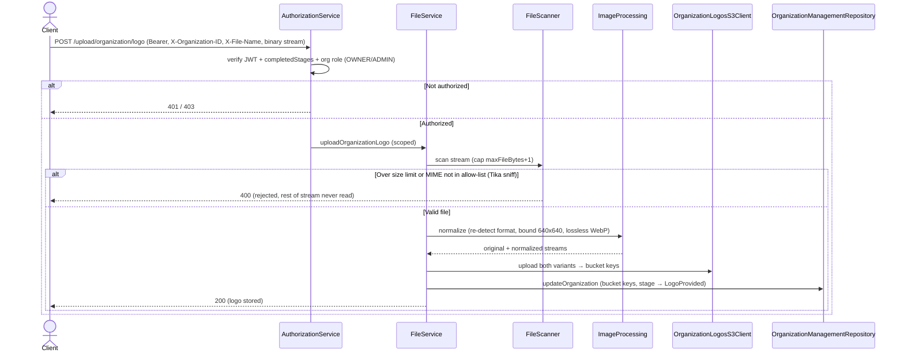

# Files Management

The file-handling subsystem of the gateway: accepting file uploads as **byte streams** (never buffering the whole file in memory), validating them (size + real MIME type detection), processing images (resize + WebP normalization), and storing/serving them through S3 with presigned URLs. Its first consumer is the organization logo upload, but the pipeline pieces (`FileScanner`, `ImageProcessing`, `TempFile`, `SupportedMediaTypes`) are generic and meant to be reused by any future upload feature.

**Scope**: transport (Tapir streaming endpoint), scanning, image processing, temp-file lifecycle, S3 storage/URLs. The *business* effect of an upload (which entity it belongs to, stage changes) belongs to the owning feature — e.g. [Organization Management](organization-management.md) owns the organization row that the logo upload updates.

## Why Tapir (and not smithy)

File uploads are the reason Tapir routes exist alongside smithy: smithy4s (JSON) routes keep a conservative 2 MB `EntityLimiter`, while Tapir routes stream binary bodies and allow 20 MB (`HttpApp.scala` — keep `TapirMaxEntitySize` in sync with `file-service.max-organization-logo-bytes`). The Tapir-backed `FileService` is listed in the **shared smithy Swagger UI** — `HttpApp.externalSmithySwaggerRoutes` passes `FileServiceEndpoints.smithy4sDocsID` to `docs[Task](...)`. Because smithy4s generates no OpenAPI spec for a Tapir service, the spec is produced by Tapir's `OpenAPIDocsInterpreter` and served from a plain Tapir endpoint at `GET /docs/specs/io.mesazon.gateway.smithy.FileService.json` (both only when `enableDocs` is on). That Tapir docs route must be mounted **before** the smithy swagger routes (see `HttpApp.externalDocsRoutes`) so it wins the path match — otherwise smithy4s handles that path and `500`s trying to load a non-existent classpath spec.

## Endpoints (Tapir, bearer auth + completed onboarding)

| Method | Path | Purpose |
|---|---|---|
| POST | `/upload/organization/logo` | Upload an organization logo (binary body; organization in the `X-Organization-ID` header, original file name in the `X-File-Name` header) |

Defined in `tapir/FileServiceEndpoints.scala`. Security logic (`AuthorizationService.auth`): valid access JWT, `OnboardStage.completedStages` (= `PhoneVerified`), **and** the caller must be assigned to the organization from the `X-Organization-ID` header as `OWNER` or `ADMIN` (disallowed role → `403 Forbidden`, no membership row → `500`) — same standard as the smithy services, see [middleware.md](../middleware.md).

## The streaming pipeline (`FileService.uploadOrganizationLogo`)

Everything runs inside one `ZIO.scoped` block; every intermediate file is a `TempFile.createScoped` (auto-deleted on scope close, even on failure).

1. **`FileScanner.scan`** — spools the incoming `ZStream[Byte]` to a temp file, taking at most `maxFileBytes + 1` bytes: if one extra byte arrives the file is over the limit and the request fails without ever reading the rest. Then detects the **actual** MIME type with Apache Tika (content sniffing — the client's declared content type is never trusted) and rejects anything outside the allowed `SupportedMediaTypes` list.
2. **`ImageProcessing.normalize`** — re-detects the image format with scrimage's `FormatDetector` (second, independent format check), decodes, bounds the image to 640×640 px (`MaxDimensionPixels`), and re-encodes as **lossless WebP**. Yields two streams: the untouched original and the normalized variant.
3. **`OrganizationLogosS3Client.upload`** — uploads both variants under `{bucketPathPrefix}/{organizationID}/{fileName}` using fixed config file names (`originalFileName` / `normalizedFileName`), returning both bucket keys.
4. **`OrganizationManagementRepository.updateOrganization`** — records the bucket keys + original file name and moves the organization to `OrganizationStage.LogoProvided`.

## S3 client (`OrganizationLogosS3Client`)

- Wraps `S3AsyncClient` + `S3Presigner` (AWS SDK v2), both built as scoped layers with static credentials from `OrganizationLogosS3ClientConfig`; `useMock = true` switches to path-style access for localstack-style testing.
- `getOriginalUrl` / `getNormalizedUrl` — **presigned GET URLs** expiring after `urlExpiresAtOffset`; logos are never served through the gateway.
- `readiness` — `HeadBucket` check, used by the health check (`ServiceUnavailableError.S3UnavailableError`).

## Supported media types

`SupportedMediaTypes` (domain enum, `ext` + `mime`): `PNG`, `JPEG`, `WEBP`; `SupportedMediaTypes.images` is the allow-list passed through the pipeline. Add new types there.

## Sequence diagram

### POST /upload/organization/logo  (Tapir streaming, Bearer + completed onboarding + OWNER/ADMIN)

All intermediate files are `TempFile.createScoped` inside one `ZIO.scoped` block — auto-deleted on scope close, even on failure.

## Key files

- Orchestration: `backend/gateway/core/src/main/scala/io/mesazon/gateway/service/FileService.scala`
- Pipeline utils: `utils/FileScanner.scala`, `utils/ImageProcessing.scala`, `utils/TempFile.scala`
- Transport: `tapir/FileServiceEndpoints.scala`, `tapir/tapir.scala` (error mapping, `TapirTask`); wiring + entity limits: `HttpApp.scala`
- S3: `clients/OrganizationLogosS3Client.scala` (+ `OrganizationLogosS3ClientConfig`)
- Domain: `backend/domain/src/main/scala/io/mesazon/domain/gateway/SupportedMediaTypes.scala`
- Config: `FileServiceConfig` (`file-service.max-organization-logo-bytes`)

## Tests

- Acceptance (see [acceptance-tests.md](../acceptance-tests.md)): `backend/gateway/it/src/test/scala/io/mesazon/gateway/it/FileApiSpec.scala` — upload happy path asserting both objects land in S3, missing `X-File-Name` header, missing token (401), invalid token (401), disallowed stage (403), missing `X-Organization-ID` header (400), non-member (500), disallowed role (403), and unsupported file type
- Functional: `fun/FileServiceSpec.scala`
- Integration (S3 via docker compose, `s3-test` module): `it/OrganizationLogosS3ClientSpec.scala`
