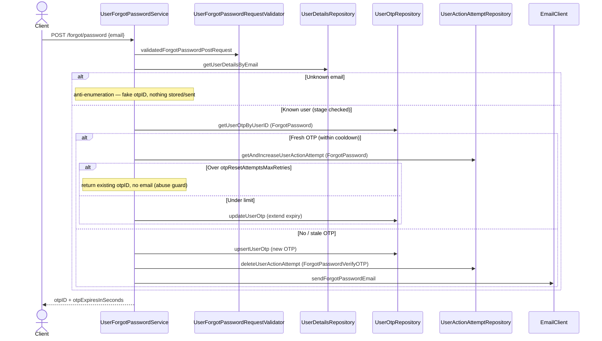
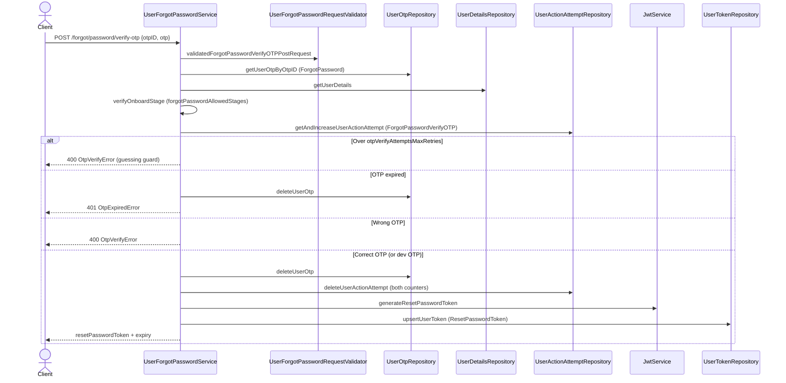
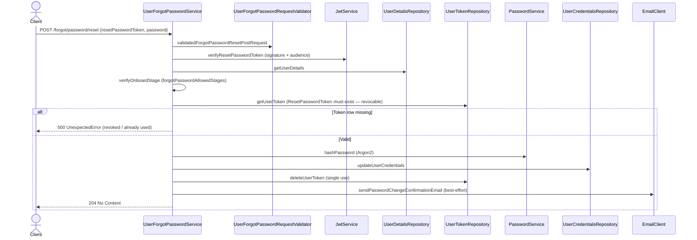

# User Forgot Password

Three-step password recovery for users who already set a password: request an OTP by email → verify the OTP to get a short-lived reset token → reset the password with that token.

**Scope**: replacing a lost password without being signed in, plus the abuse defenses that make that safe on unauthenticated endpoints — email anti-enumeration, per-user attempt limits on both OTP *requests* and OTP *verifications*, and a single-use DB-backed reset token. It reuses the shared OTP machinery (`UserOtpRepository`, type `ForgotPassword`) and token model ([User Token Management](user-token-management.md)); changing a password while signed in is not implemented anywhere yet. Users still before `PasswordProvided` have nothing to recover and are rejected by stage check.

## Endpoints (smithy, no auth — identity is proven by OTP / reset token)

| Method | Path | Purpose |
|---|---|---|
| POST | `/forgot/password` | Request a recovery OTP by email |
| POST | `/forgot/password/verify-otp` | Exchange OTP for a reset-password token |
| POST | `/forgot/password/reset` (204) | Set the new password using the reset token |

Defined in `backend/gateway/core/src/main/smithy/UserForgotPasswordService.smithy`. Allowed stages for the whole flow: `OnboardStage.forgotPasswordAllowedStages` (= `signInAllowedStages`: `PasswordProvided`, `PhoneVerification`, `PhoneVerified`) — a user without a password yet cannot use recovery.

## Flow

### POST /forgot/password
1. Validate email. **Unknown email → anti-enumeration**: return a fake generated `otpID` with the normal response shape; nothing stored or sent.
2. Known user with a still-fresh OTP (outside resend cooldown): count the request via `UserActionAttempt` (`ActionAttemptType.ForgotPassword`). Over `otpResetAttemptsMaxRetries` → silently return the existing `otpID` **without sending email** (see in-code comment: same-OTP-until-cooldown is deliberate abuse prevention). Under the limit → extend the OTP expiry and return it.
3. No/stale OTP: generate a new OTP, upsert with `otpExpiresAtOffset`, reset the `ForgotPasswordVerifyOTP` attempt counter, and email the OTP (retried; failure fails the request).

### POST /forgot/password/verify-otp
1. Load OTP by `otpID` (type `ForgotPassword`), load user, check stage.
2. **Verify attempt limiting**: increase `ForgotPasswordVerifyOTP` attempts; over `otpVerifyAttemptsMaxRetries` → `BadRequestError.OtpVerifyError` (blocks OTP guessing).
3. Expired OTP → delete + `UnauthorizedError.OtpExpiredError`. Wrong OTP → `BadRequestError.OtpVerifyError`. Correct → delete the OTP and both attempt counters.
   - **Dev mode**: when `user-forgot-password.is-dev` is true (`IS_DEV` env var), the fixed OTP `123QWE` (`DevOtp` / `verifyOtpInDev` in `service/service.scala`) is also accepted. Must stay off in production.
4. Issue a reset-password JWT (`JwtService.generateResetPasswordToken`, audience `auth:reset_password`) and persist it in `user_token` (type `ResetPasswordToken`). Response: token + expiry.

### POST /forgot/password/reset
1. Verify the reset JWT signature/audience **and** require the token row to exist in `user_token` (revocable, single-use).
2. Hash the new password (Argon2) and update `user_credentials`; delete the reset token row (one use only).
3. Send a password-change confirmation email — best-effort: retried, final failure only logged, request still succeeds (204).

Note: existing refresh tokens are **not** deleted on reset; sign-in deletes all tokens on next login.

## Sequence diagrams

### POST /forgot/password  (request a recovery OTP)

### POST /forgot/password/verify-otp  (OTP → reset token)

### POST /forgot/password/reset  (reset token → new password, 204)

## Key files

The feature follows the consolidated per-feature layout of [adding-a-feature.md](../adding-a-feature.md): one domain file, one request validator, one arbitraries trait per layer.

- Domain: `backend/domain/src/main/scala/io/mesazon/domain/gateway/UserForgotPassword.scala` (the `ForgotPasswordPostRequest`/`ForgotPasswordVerifyOTPPostRequest`/`ForgotPasswordResetPostRequest` request models)
- Validator: `validation/service/UserForgotPasswordRequestValidator.scala` (one `validated<Request>` per fallible request; email goes through the generic `EmailValidator`)
- Arbitraries: `testkit/base/UserForgotPasswordDomainArbitraries.scala`, `gateway/utils/UserForgotPasswordSmithyArbitraries.scala`
- Service: `backend/gateway/core/src/main/scala/io/mesazon/gateway/service/UserForgotPasswordService.scala`
- Tokens: `service/JwtService.scala`; hashing: `service/PasswordService.scala`
- Repositories: `UserOtpRepository`, `UserActionAttemptRepository`, `UserCredentialsRepository`, `UserTokenRepository`, `UserDetailsRepository`
- Config: `UserForgotPasswordConfig` (`otpExpiresAtOffset`, `otpResendCooldown`, `otpResetAttemptsMaxRetries`, `otpVerifyAttemptsMaxRetries`, email retry settings)

## Tests

- Acceptance (see [acceptance-tests.md](../acceptance-tests.md)): `backend/gateway/it/src/test/scala/io/mesazon/gateway/it/UserForgotPasswordApiSpec.scala` — all three endpoints: OTP issue/extend/maxed-attempts behavior, anti-enumeration for unknown emails, verify-OTP attempt limit, full reset happy path, plus the standard error matrix
- Functional: `fun/UserForgotPasswordServiceSpec.scala`
- Validator units: `unit/validation/service/UserForgotPasswordRequestValidatorSpec.scala`
- Integration: `it/UserActionAttemptRepositorySpec.scala`, `it/UserOtpRepositorySpec.scala`, `it/EmailClientSpec.scala`
