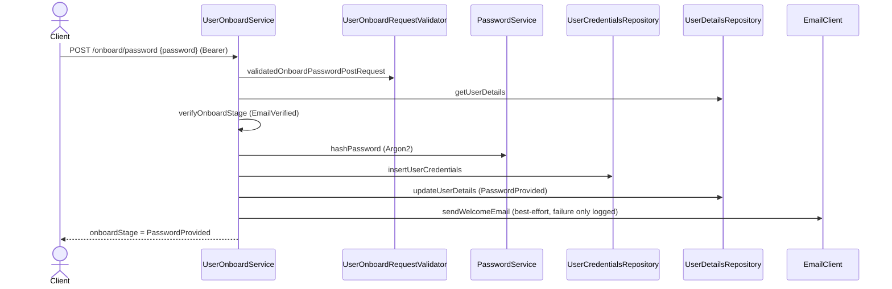
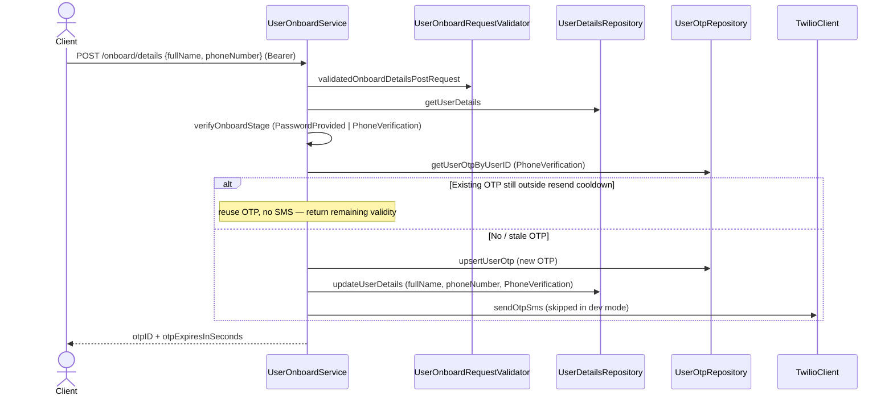
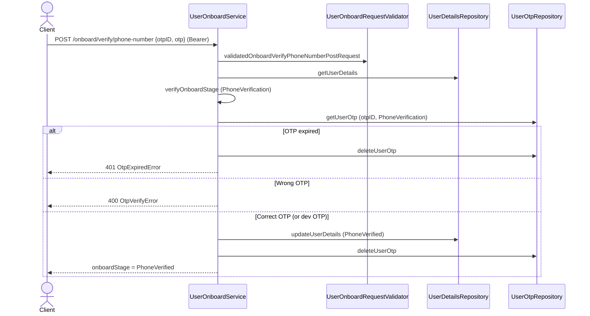
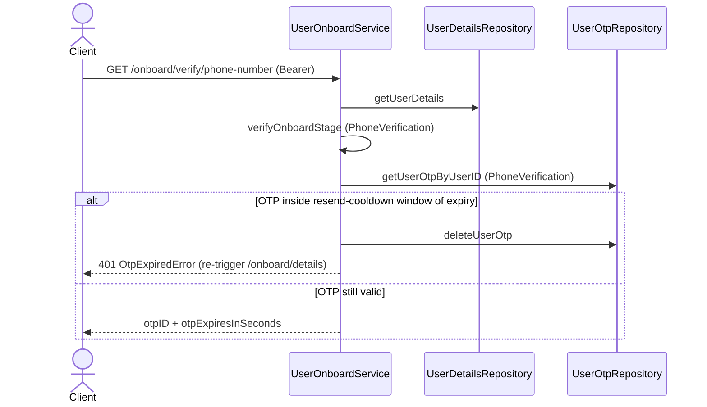

# User Onboarding

Guides a user from a verified email to a fully onboarded account: set a password → provide full name + phone number → verify the phone via SMS OTP. Completing it (`PhoneVerified`) is what unlocks the business features gated with `@completedOnboardStage` (currently organization management and file uploads).

**Scope**: the three onboarding steps *after* email verification, plus ownership of the `OnboardStage` state machine itself — the stage enum and every per-flow allowed-stage list live here even though other features consume them. Account/email creation is [User Sign up](user-signup.md); using the password to authenticate later is [User Sign in](user-signin.md). Every flow in the codebase checks the user's current `OnboardStage` against an allowed list (`verifyOnboardStage` in `service/service.scala`) and fails with `ForbiddenError.InvalidOnboardStage` (`403 Forbidden`) otherwise, which makes the stage lists below load-bearing for all features.

## Stage machine

`EmailVerification` → `EmailVerified` → `PasswordProvided` → `PhoneVerification` → `PhoneVerified` (**completed**)

Stages and per-flow allowed lists live in `backend/domain/src/main/scala/io/mesazon/domain/gateway/OnboardStage.scala` (the `OnboardStage` enum + companion — it has its own file since other features read it too, see [adding-a-feature.md § Where newtypes and enums live](../adding-a-feature.md#where-newtypes-and-enums-live)). When adding a stage, update the companion-object lists (there's a comment warning about this). The smithy `OnboardStage` enum mirrors the domain enum; mapping helpers `onboardStageFromDomainToSmithy` / `onboardStageFromSmithyToDomain` are in `service/service.scala`.

## Endpoints (smithy, bearer auth — access JWT)

| Method | Path | Required stage | Purpose |
|---|---|---|---|
| POST | `/onboard/password` | `EmailVerified` | Set the account password |
| POST | `/onboard/details` | `PasswordProvided`, `PhoneVerification` | Provide full name + phone number, trigger SMS OTP |
| POST | `/onboard/verify/phone-number` | `PhoneVerification` | Verify SMS OTP, complete onboarding |
| GET | `/onboard/verify/phone-number` | `PhoneVerification` | Fetch current OTP ID + remaining validity |

Defined in `backend/gateway/core/src/main/smithy/UserOnboardService.smithy`. Bearer auth is enforced by `ServerMiddleware` → `AuthorizationService` (verifies the access JWT and puts `AuthedUser` into `AuthState`; the service reads `authState.get`).

## Flow

### POST /onboard/password
Hash the password with Argon2 (`PasswordService`), insert `UserCredentialsRow`, move stage to `PasswordProvided`, then send a welcome email. The welcome email is **best-effort**: retried, but a final failure is only logged (`catchAllCause`), never fails the request.

### POST /onboard/details
Stores `fullName` + `phoneNumber` on user details, moves stage to `PhoneVerification`, generates a `PhoneVerification` OTP and sends it via SMS (`TwilioClient`, with retries). Resend throttling: if an existing OTP is still outside the resend-cooldown window it is reused and no SMS is sent — the response returns its remaining `otpExpiresInSeconds`. Can be called again from `PhoneVerification` to change the number / resend.

### POST /onboard/verify/phone-number
Loads the OTP by (`otpID`, `userID`, type `PhoneVerification`). Expired → OTP deleted + `UnauthorizedError.OtpExpiredError`. Wrong OTP → `BadRequestError.OtpVerifyError`. Correct → stage `PhoneVerified` and the OTP is deleted. `PhoneVerified` is the only member of `OnboardStage.completedStages` — it unlocks endpoints marked `@completedOnboardStage` (e.g. organization management).

**Dev mode**: when `user-onboard.is-dev` is true (`IS_DEV` env var), `/onboard/details` skips the Twilio SMS entirely, and `/onboard/verify/phone-number` also accepts the fixed OTP `123QWE` (`DevOtp` / `verifyOtpInDev` in `service/service.scala`). Must stay off in production.

### GET /onboard/verify/phone-number
Returns the pending OTP's `otpID` and remaining seconds so the client can restore the verify screen. If the OTP is inside the resend-cooldown window of its expiry it is deleted and the call fails with `OtpExpiredError` (client should re-trigger `/onboard/details`).

## Sequence diagrams

All four endpoints are Bearer-authenticated: `ServerMiddleware` → `AuthorizationService` verifies the access JWT and puts `AuthedUser` in `AuthState` before the handler runs (omitted below for clarity).

### POST /onboard/password  (stage → PasswordProvided)

### POST /onboard/details  (stage → PhoneVerification, sends SMS OTP)

### POST /onboard/verify/phone-number  (stage → PhoneVerified, completes onboarding)

### GET /onboard/verify/phone-number  (restore verify screen)

## Key files

The feature follows the consolidated per-feature layout of [adding-a-feature.md](../adding-a-feature.md): one domain file, one request validator, one arbitraries trait per layer.

- Domain: `backend/domain/src/main/scala/io/mesazon/domain/gateway/UserOnboard.scala` (the `OnboardPasswordPostRequest`/`OnboardDetailsPostRequest`/`OnboardVerifyPhoneNumberPostRequest` request models); the `OnboardStage` enum lives in its own `OnboardStage.scala`
- Validator: `validation/service/UserOnboardRequestValidator.scala` (one `validated<Request>` per fallible request)
- Arbitraries: `testkit/base/UserOnboardDomainArbitraries.scala`, `gateway/utils/UserOnboardSmithyArbitraries.scala`
- Service: `backend/gateway/core/src/main/scala/io/mesazon/gateway/service/UserOnboardService.scala`
- Password hashing: `service/PasswordService.scala` (Argon2, `PasswordConfig`)
- SMS: `clients/TwilioClient.scala`; Email: `clients/EmailClient.scala`
- Config: `UserOnboardConfig` (OTP expiry offset, resend cooldown, SMS/email retry settings)

## Tests

- Acceptance (see [acceptance-tests.md](../acceptance-tests.md)): `backend/gateway/it/src/test/scala/io/mesazon/gateway/it/UserOnboardApiSpec.scala` — all four endpoints, each with happy path + the standard error matrix (missing/invalid access token, disallowed stage, validation, wrong/expired/missing OTP)
- Functional: `fun/UserOnboardServiceSpec.scala`
- Units: `unit/service/PasswordServiceSpec.scala`, `unit/validation/service/UserOnboardRequestValidatorSpec.scala`
- Integration: `it/UserCredentialsRepositorySpec.scala`, `it/UserOtpRepositorySpec.scala`, `it/TwilioClientSpec.scala`
