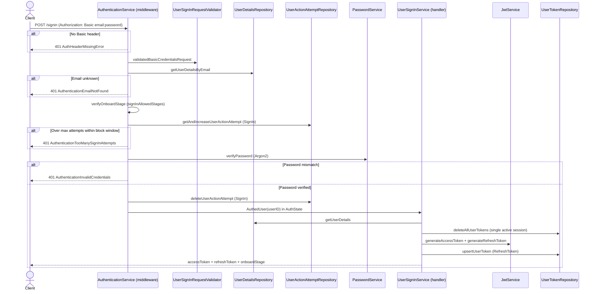

# User Sign in

Password sign-in over HTTP Basic auth: verifies email + password, defends against brute force, and starts a fresh session by rotating out all previously issued tokens.

**Scope**: authenticating a user who already has a password and issuing the session tokens. Credential *verification* happens in middleware (`AuthenticationService`), not in the endpoint handler — the handler only runs for an already-authenticated user and its job is to issue tokens. Adjacent concerns live elsewhere: recovering a lost password is [User Forgot Password](user-forgot-password.md); keeping the session alive afterwards is [User Token Management](user-token-management.md); users who never set a password must finish [User Sign up](user-signup.md) first.

## Endpoint (smithy, `@httpBasicAuth`)

| Method | Path | Required stage | Purpose |
|---|---|---|---|
| POST | `/signin` | `PasswordProvided`, `PhoneVerification`, `PhoneVerified` | Authenticate and issue access + refresh tokens |

Defined in `backend/gateway/core/src/main/smithy/UserSignInService.smithy`. No request body — email/password travel in the `Authorization: Basic` header.

## Flow

### 1. Middleware authentication (`AuthenticationService.auth`)
Wired by `ServerMiddleware` for any smithy service annotated `@httpBasicAuth`:

1. Extract Basic credentials from the `Authorization` header → `UnauthorizedError.AuthHeaderMissingError` (`401`) if absent; validate format (`UserSignInRequestValidator.validatedBasicCredentialsRequest`, which turns the raw `AuthenticationService.BasicCredentialsRequest` into the `BasicCredentials` domain model).
2. Look up user by email → `UnauthorizedError.AuthenticationEmailNotFound` if unknown.
3. Stage must be in `OnboardStage.signInAllowedStages` — a user can sign in as soon as they have a password, even before phone verification (so they can resume onboarding).
4. **Brute-force protection**: `UserActionAttemptRepository.getAndIncreaseUserActionAttempt(userID, ActionAttemptType.SignIn)`. If attempts exceed `AuthenticationConfig.signInAttemptsMax` and the last attempt is within `signInAttemptsBlockDuration`, fail `UnauthorizedError.AuthenticationTooManySignInAttempts`. Attempt counter is deleted on successful password verification (block auto-expires after the duration).
5. Verify password against the stored Argon2 hash (`PasswordService.verifyPassword`) → `UnauthorizedError.AuthenticationInvalidCredentials` on mismatch.
6. On success, store `AuthedUser(userID)` in `AuthState` (request-scoped) for the handler.

### 2. Handler (`UserSignInService.signInPost`)
1. Read `AuthedUser` from `AuthState`, load user details.
2. **Delete all existing user tokens** — signing in invalidates every previously issued refresh/reset token (single active session policy).
3. Generate access JWT + refresh JWT (`JwtService`), persist the refresh token (`user_token` table, type `RefreshToken`).
4. Respond with `accessToken`, `refreshToken`, `accessTokenExpiresInSeconds`, and the current `onboardStage` (client uses it to resume onboarding if incomplete).

## Sequence diagram

### POST /signin  (Basic auth → session tokens)

Two phases: credential verification in middleware (`AuthenticationService.auth`), then token issuing in the handler (`UserSignInService.signInPost`).

## Key files

The feature follows the consolidated per-feature layout of [adding-a-feature.md](../adding-a-feature.md), with one deviation: `SignInPost` has **no request body** (credentials travel in the Basic-auth header), so there is no smithy request shape and therefore no smithy-arbitraries trait — just the domain model, the validator, and a domain-arbitraries trait.

- Domain: `backend/domain/src/main/scala/io/mesazon/domain/gateway/UserSignIn.scala` (the `BasicCredentials` model)
- Validator: `validation/service/UserSignInRequestValidator.scala` (`validatedBasicCredentialsRequest`; email goes through the generic `EmailValidator`). Its input, the raw `BasicCredentialsRequest` (email/password strings), is defined in `AuthenticationService` where the Basic header is parsed.
- Arbitraries: `testkit/base/UserSignInDomainArbitraries.scala`
- Handler: `backend/gateway/core/src/main/scala/io/mesazon/gateway/service/UserSignInService.scala`
- Credential auth: `service/AuthenticationService.scala`; middleware wiring: `middleware/ServerMiddleware.scala`
- Request-scoped auth state: `state/AuthState.scala` (`io.mesazon.gateway.state`)
- Attempt tracking: `repository/UserActionAttemptRepository.scala`
- Config: `AuthenticationConfig` (`signInAttemptsMax`, `signInAttemptsBlockDuration`)

## Tests

- Acceptance (see [acceptance-tests.md](../acceptance-tests.md)): `backend/gateway/it/src/test/scala/io/mesazon/gateway/it/UserSignInApiSpec.scala` — happy path (asserts exactly one refresh-token row + attempt counter cleared), token rotation on re-sign-in, lockout after max failed attempts (correct password still rejected), plus missing credentials / invalid email / wrong password / disallowed stage
- Functional: `fun/UserSignInServiceSpec.scala`, `fun/AuthenticationServiceSpec.scala`
- Integration: `it/UserActionAttemptRepositorySpec.scala`, `it/UserCredentialsRepositorySpec.scala`, `it/UserTokenRepositorySpec.scala`
