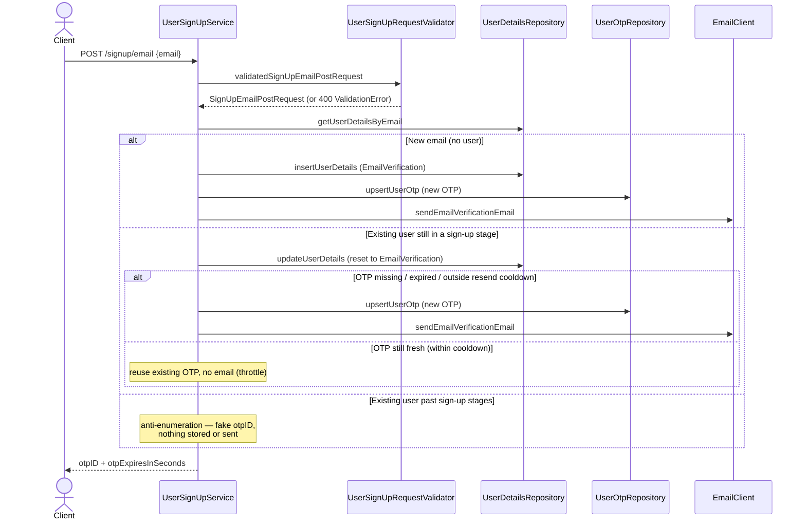
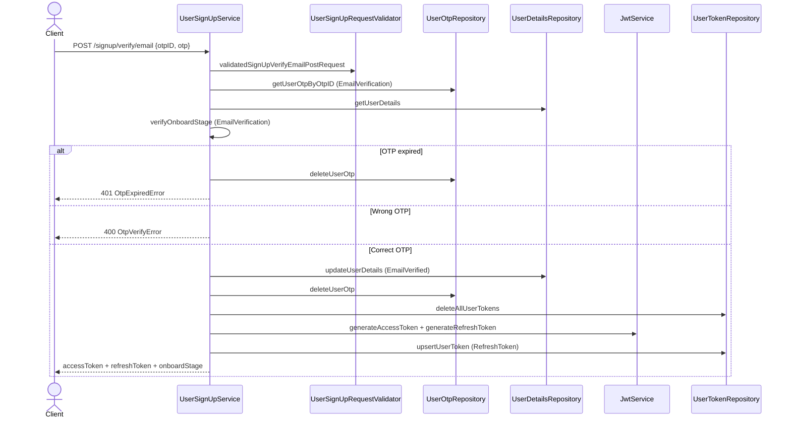

# User Sign up

Email-based sign up with OTP email verification. This feature owns the **start of the user lifecycle**: it is the only place a `UserDetails` row is created, and it carries the user through the first two onboard stages (`EmailVerification` → `EmailVerified`).

**Scope**: proving ownership of an email address and creating the account shell. It does *not* collect a password, name, or phone number — that is [User Onboarding](user-onboarding.md), which the client continues into using the access/refresh tokens issued at the end of email verification (token semantics in [User Token Management](user-token-management.md)). Both endpoints are unauthenticated by design; abuse is mitigated with resend cooldowns and anti-enumeration responses rather than auth.

## Endpoints (smithy, no auth)

| Method | Path | Purpose |
|---|---|---|
| POST | `/signup/email` | Start sign up: create user, generate OTP, email it |
| POST | `/signup/verify/email` | Verify the OTP, mark email verified, issue tokens |

Defined in `backend/gateway/core/src/main/smithy/UserSignupService.smithy`.

## Flow

### POST /signup/email
1. Validate email (`UserSignUpRequestValidator.validatedSignUpEmailPostRequest`).
2. Look up user by email, then look up an existing `EmailVerification` OTP:
   - **New user** — insert `UserDetailsRow` at stage `EmailVerification`, generate OTP, upsert it with expiry `now + otpEmailVerificationExpiresAtOffset`, send verification email.
   - **Existing user still in a sign-up stage** (`OnboardStage.signUpEmailStages` = `EmailVerification`, `EmailVerified`) — resend path: the user's stage is reset to `EmailVerification` (an `EmailVerified` user re-signing up must verify again), then if the current OTP is missing/expired/inside the resend-cooldown window a new OTP is generated and emailed; otherwise the existing OTP is reused and **no email is sent** (resend throttling).
   - **Existing user past sign-up stages** — anti-enumeration: returns a *fake* freshly generated `otpID` with the normal response shape, sends nothing, writes nothing. Callers cannot detect whether an email is registered.
3. Response: `otpID` + `otpExpiresInSeconds`.

### POST /signup/verify/email
1. Validate, load OTP by `otpID` (type `EmailVerification`), load user details.
2. Stage must be in `OnboardStage.signUpVerifyEmailStages` (= `EmailVerification`), else `ForbiddenError.InvalidOnboardStage` (`403`).
3. OTP expired → delete OTP row and fail `UnauthorizedError.OtpExpiredError`. Wrong OTP → `BadRequestError.OtpVerifyError`. Correct → stage set to `EmailVerified`, OTP deleted.
   - **Dev mode**: when `user-sign-up.is-dev` is true (`IS_DEV` env var), the fixed OTP `123QWE` (`DevOtp` / `verifyOtpInDev` in `service/service.scala`) is also accepted. Must stay off in production.
4. All existing user tokens are deleted, then a fresh access JWT + refresh JWT are issued and the refresh token is persisted (`user_token` table). Response returns both tokens, expiry, and the new `onboardStage`.

Email sends are retried with `Schedule.recurs(maxRetries) && Schedule.exponential(delay)`; on this flow a final failure fails the request.

## Sequence diagrams

### POST /signup/email

### POST /signup/verify/email

## Key files

The feature follows the consolidated per-feature layout of [adding-a-feature.md](../adding-a-feature.md): one domain file, one request validator, one arbitraries trait per layer.

- Domain: `backend/domain/src/main/scala/io/mesazon/domain/gateway/UserSignUp.scala` (the `SignUpEmailPostRequest`/`SignUpVerifyEmailPostRequest` request models)
- Validator: `validation/service/UserSignUpRequestValidator.scala` (one `validated<Request>` per fallible request; email goes through the generic `EmailValidator`)
- Arbitraries: `testkit/base/UserSignUpDomainArbitraries.scala`, `gateway/utils/UserSignUpSmithyArbitraries.scala`
- Service: `backend/gateway/core/src/main/scala/io/mesazon/gateway/service/UserSignUpService.scala`
- Repositories: `UserDetailsRepository`, `UserOtpRepository`, `UserTokenRepository`
- Stage lists: `backend/domain/src/main/scala/io/mesazon/domain/gateway/UserOnboard.scala`
- Config: `UserSignUpConfig` (`otpEmailVerificationExpiresAtOffset`, `otpEmailVerificationResendCooldown`, `sendEmailVerificationEmailMaxRetries`, `sendEmailVerificationEmailRetryDelay`)

## Tests

- Acceptance (black-box HTTP against the running gateway, see [acceptance-tests.md](../acceptance-tests.md)): `backend/gateway/it/src/test/scala/io/mesazon/gateway/it/UserSignUpApiSpec.scala` — happy paths for new/re-sign-up, anti-enumeration path, plus the standard error matrix (validation, wrong/expired OTP, disallowed stage)
- Functional (mocked repos/clients): `src/test/scala/io/mesazon/gateway/fun/UserSignUpServiceSpec.scala`
- Integration (Postgres via docker compose): `it/UserOtpRepositorySpec.scala`, `it/UserDetailsRepositorySpec.scala`, `it/UserTokenRepositorySpec.scala`
- Validator units: `unit/validation/service/UserSignUpRequestValidatorSpec.scala`
