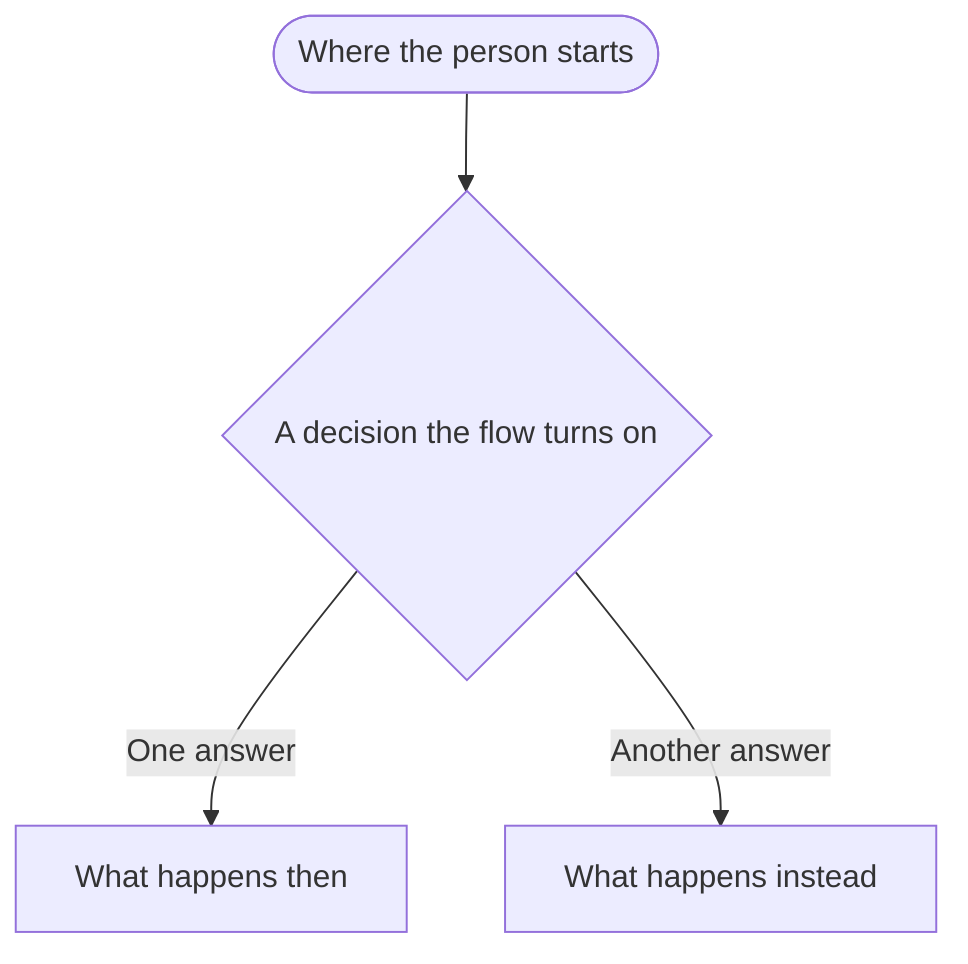

<!--
HOW TO WRITE AN EPIC (delete this block in your copy)

Keep the `---` front matter at the top. Jekyll only builds files that have it; without it
the page is served as a raw file instead of rendering on the site.

Audience: non-engineers. Someone who has never opened the codebase should be able to read
this start to finish and understand what the product does.

Write in plain, simple English:
- Short sentences. Everyday words. Say "wrong code" before "invalid OTP".
- No Scala/type/class/file names, no endpoint paths, no internal jargon, no unexplained
  abbreviations. Spell out an acronym the first time you use it, and add it to
  pages/glossary.md plus pages/_includes/abbreviations.md so every later use gets a hover
  tooltip. Keep the tooltip and the glossary saying the same thing.
- Keep the abbreviations include as the last line of the epic. It renders nothing and turns
  every acronym in the page into a hoverable definition.
- Describe what a user can see and do, not the implementation that makes it happen.
- If a sentence only makes sense to someone who has read the code, rewrite it.

Keep it true:
- Every stage name, error code, field rule, limit, and business rule must match what the
  code actually does today. Check it against the matching agent-docs/features/*.md doc and,
  where that doesn't settle it, the code itself.
- Update this epic whenever the feature changes — in the same change, not later. A
  confidently wrong epic is worse than a missing one.
-->

---
title: 1. Epic Title
---

# &lt;Epic Title&gt;

### Overview

One or two sentences: what the user can now do, and why it matters to the business.

<!--
OPTIONAL: a mermaid diagram here, directly after the overview.

Add one only when the journey is tangled enough that a picture genuinely beats the prose —
several branches, or a loop back to an earlier step. A diagram that just restates steps the
reader is about to read costs more space than it earns, so most epics do not need one.

Keep it small. A handful of nodes, everyday wording matching the steps below, no type or
endpoint names. If it does not fit on a screen, it is doing too much: cut it back to the one
part that is hard to follow in words.

-->

### Related / Out of scope

Three flavours, and the difference matters to a reader deciding where to look next. Use only the ones that apply.

- **Related**: adjacent epics a reader should know about — how someone resumes this flow, or what consumes its output. One line each saying what the relation is, not a restatement of that epic.
- **Out of scope**: something a reader might reasonably expect here, that exists but is covered elsewhere.
- **Not built yet**: something a reader might reasonably expect here that does not exist anywhere. Say so plainly rather than letting the surrounding prose imply it works.

A reader should never have to guess whether an omission is deliberate or an accident.

### Requirements across the epic

Only what holds true for more than one step. Anything belonging to a single step goes in that step's own **Requirements** list further down — keep this section short, or it turns back into a dumping ground for the whole epic.

Number each list plainly, `1.`, `2.`, `3.`. Do not invent requirement IDs.

#### Functional

What the product does, stated so a reader could check each one off. Rules that span the whole journey — the order of the steps, what every step has in common, what carries between them.

1. ...
2. ...

#### Non-functional

Constraints the flow depends on but doesn't state outright: rate-limiting/throttling, retries on external sends, anti-abuse/security posture, environment-specific bypasses, data handling/retention. If a business scenario implies one of these (for example, "no email is sent" implies a throttle exists), state the rule here rather than leaving a reader to infer it.

1. ...
2. ...

### User flow

Numbered list of the steps a user goes through, in order. Link each to its section below.

1. [Step name](#1-step-name)
2. [Step name](#2-step-name)

### Prerequisites

Any concept a reader needs before the steps make sense (e.g. an onboard-stage state machine, a role model). Keep this short — link out to the authoritative source (an `agent-docs/features/*.md` doc) rather than duplicating its detail; restate only what's needed to read the steps below.

<!--
Every step below repeats the same four sections in this order:

  Business Scenarios      the situations the step has to handle
  Requirements            the rules that fall out of them
  Request / Response /    what goes in, what comes back, what it changed
    Outcome
  Http Error Responses    what can go wrong

Scenarios come first on purpose — work them out, and the requirements follow.
-->

### 1. &lt;Step name&gt;

**Who can reach this step: [...]**

Whatever gates the step — the onboard stages allowed, a required role, organization membership — or "anyone" when it is open to all. Note any case the gate does not apply to.

- Short bullets: where the user comes from, what they do, where they go next.

#### Business Scenarios

Every situation this step must handle, including the awkward ones — repeat submissions, expired or reused codes, someone arriving at the wrong point. Number them sequentially within the step; don't restart or repeat a number.

| **Scenarios** | **Requirements** |
| --- | --- |
| 1. ... | - ... |
| 2. ... | - ... |

#### Requirements

What this step must do, plainly numbered, drawn from the scenarios above. Keep them specific to this step — anything true of several steps belongs in [Requirements across the epic](#requirements-across-the-epic) instead. A step-specific constraint (a field rule, a one-off limit) can sit here too; there is no separate non-functional list per step.

1. ...
2. ...

#### Request / Response / Outcome

What goes in, what comes back, and what it changed. Keep this section tight — it is the part someone reads when planning the work, not a narrative.

**Type** carries the real type from the API contract — `String`, `Long`, `UUID`, `Object`, or a named enum such as `OnboardStage` — not a loose word like "Number" or "Enum". Keep it to that one column; do not split it per language. Nest an object's fields underneath it, prefixed with `→`.

**Request**

| **Field Name** | **Type** | **Format** | **Description** |
| --- | --- | --- | --- |
| | | | |

Say `Request is empty.` when the step sends no fields and the person is identified by their session.

**Response**

| **Field Name** | **Type** | **Format** | **Description** |
| --- | --- | --- | --- |
| | | | |

Say `Response is empty.` when the step returns no fields — do not invent a table to fill the space, and do not describe the side effects here. Those belong in **Outcome**. Where a step has more than one response (a lookup alongside a submit), give each its own small table under a one-line label.

**Outcome**

What actually changed once the step succeeds, as short bullets: the stage the person moves to, what was saved or deleted, what was sent, what was revoked. This is where a step with an empty response earns its place — the response tells a reader nothing, so the outcome has to tell them everything.

Cover the unhappy paths too when they change something: an expired code that gets deleted, a wrong code that deliberately changes nothing.

- ...
- ...

#### Http Error Responses

Check these against the errors the code really returns, codes and status alike; a plausible-looking wrong code is the easiest thing in an epic to get wrong and the hardest for a reader to catch. Include the ones that come from the step's own gate, not just validation.

| **Http Code** | **Code** | **Description** |
| --- | --- | --- |
| 400 | `VALIDATION_ERROR` | Form validation error |
| 500 | `INTERNAL_SERVER_ERROR` | Unexpected error |

<!--
Repeat the "### N. <Step name>" block above for every step, numbering steps sequentially
(no repeated or skipped numbers, including across near-duplicate step names).
-->

### Known gaps and open questions

Everything above says what the product does today. This section is the opposite: situations the epic has not decided yet, behavior that looks wrong or unintended, and questions that need a product answer before anything gets built. Say plainly that none of it exists yet, so nobody mistakes a gap for a feature.

One `####` subsection per gap: what happens today, why it matters, then a **To decide:** line naming the question someone has to answer. Number them, and do not reuse the step numbering style — a gap is not a step. Drop the whole section when there is nothing in it; an empty heading is worse than none.

Reviewing an epic against the code is how this section gets filled. Behavior the code has but the epic never described belongs above as a requirement; behavior the epic assumes but the code never implements belongs here.


